# Anemo — Complete Technical Documentation
## For Bachelor of Science in Information Technology (BSIT) Thesis

---

## Table of Contents

1. [System Overview](#1-system-overview)
2. [System Features](#2-system-features)
3. [End-to-End System Flow](#3-end-to-end-system-flow)
4. [Technology Stack Summary](#4-technology-stack-summary)
5. [Frontend Architecture](#5-frontend-architecture)
6. [Backend & Serverless Architecture](#6-backend--serverless-architecture)
7. [AI/ML Architecture](#7-aiml-architecture)
8. [Database Architecture](#8-database-architecture)
9. [Authentication & Security](#9-authentication--security)
10. [Application Routing Structure](#10-application-routing-structure)
11. [Component Inventory](#11-component-inventory)
12. [Custom React Hooks](#12-custom-react-hooks)
13. [Genkit AI Flows (Server-Side AI)](#13-genkit-ai-flows-server-side-ai)
14. [CNN Ensemble Architecture (10 Models)](#14-cnn-ensemble-architecture-10-models)
15. [ML Training Pipeline](#15-ml-training-pipeline)
16. [Progressive Web App (PWA)](#16-progressive-web-app-pwa)
17. [Performance Optimizations](#17-performance-optimizations)
18. [Deployment Architecture](#18-deployment-architecture)
19. [Complete Dependency List](#19-complete-dependency-list)
20. [API & Server Actions](#20-api--server-actions)
21. [Internationalization](#21-internationalization)
22. [Development Tools & Scripts](#22-development-tools--scripts)

---

## 1. System Overview

**Anemo AI v3** is a production-grade Progressive Web Application (PWA) for **non-invasive anemia screening** using computer vision and generative artificial intelligence. The system combines **edge machine learning** (TensorFlow.js) with **cloud AI** (Google Genkit + Gemini) to analyze three body parts — **palm skin**, **fingernails**, and **conjunctiva** (under-eye) — and estimate hemoglobin levels to classify anemia severity.

### Key Characteristics
- **Privacy-Preserving**: All CNN inference runs on-device in the browser (Edge AI)
- **Offline-Capable**: Full PWA with Service Worker caching and IndexedDB model storage
- **Multi-Modal Analysis**: Visual AI + Lab Report OCR + Symptom Questionnaire
- **Clinically Aligned**: WHO hemoglobin thresholds for severity classification
- **Region-Optimized**: Focuses on Iloilo/Panay Island healthcare providers
- **Multi-Language**: English, Tagalog, Hiligaynon (Ilonggo)

---

## 2. System Features

Anemo AI v3 provides a comprehensive set of health screening, educational, and lifestyle features designed for accessibility and accuracy. Each feature is explained below with its purpose, how it works, and the underlying technology.

### 2.1 Multimodal Anemia Screening (Core Feature)

The primary function of the system is **non-invasive anemia detection** from photographs of three body parts: **palm skin**, **fingernails**, and **under-eye conjunctiva**. Unlike traditional anemia diagnosis which requires a blood test (Complete Blood Count), Anemo AI estimates hemoglobin levels through visual analysis of pallor — the clinical sign of reduced blood oxygen-carrying capacity visible in skin and mucous membranes.

**How it works:**
1. The user opens the Multimodal Analysis page and captures three photos using their device camera.
2. Each photo is preprocessed through a color normalization pipeline that corrects for ambient lighting, white balance, and camera sensor differences — ensuring consistent input regardless of the device used.
3. All three images are fed into a **10-model CNN ensemble** running entirely in the browser via TensorFlow.js. The ensemble is organized in three tiers: Quality Scouts (reject bad images), Deep Specialists (produce independent anemia confidence scores from different neural architectures), and Meta-Judges (aggregate and arbitrate the final consensus).
4. The consensus engine (running in a Web Worker to avoid blocking the UI) computes a weighted average of all model outputs and converts the confidence score into an estimated hemoglobin value using the formula: `Hgb (g/dL) = 5.0 + confidence × 11.0`.
5. The estimated hemoglobin is classified into WHO-aligned severity categories: Normal (>12 g/dL), Mild (10–12), Moderate (7–10), or Severe (<7).
6. Simultaneously, the captured images are sent to the server via a Next.js Server Action, which invokes the `generateImageDescription` Genkit flow. Google Gemini 2.5 Flash Lite analyzes each image and produces a detailed clinical description, noting specific biomarkers like conjunctival pallor, nailbed color, and palmar crease visibility.
7. The final report combines the CNN ensemble's hemoglobin estimate with Gemini's clinical narrative and presents the user with a severity classification, confidence score, clinical description, and personalized health recommendations.

**Privacy guarantee:** All CNN inference happens on-device — images are never uploaded for the machine learning prediction. Only the optional AI enhancement step sends images to the server.

### 2.2 Single-Image Quick Analysis

For quick checks, users can analyze a single body part image instead of all three. The system runs the same CNN ensemble pipeline on the single image and produces a result, though with lower confidence than the multimodal analysis since it has fewer data points for cross-verification.

### 2.3 Live Camera Analysis (Real-Time)

The live analysis mode streams the device camera feed and runs CNN inference on every captured frame at a configurable interval. As the user moves and adjusts their hand or eye positioning, a live hemoglobin estimate and severity indicator overlay updates in real time on top of the camera feed. This allows users to find the optimal angle and lighting before committing to a full analysis.

### 2.4 CBC Lab Report OCR

Users who have already obtained a physical CBC (Complete Blood Count) lab report from a clinic can photograph or upload the document. The system uses **Tesseract.js 7.0** (Optical Character Recognition) combined with **Gemini 2.5 vision** to extract key blood parameters: hemoglobin (Hgb), hematocrit (HCT), red blood cell count (RBC), mean corpuscular volume (MCV), and mean corpuscular hemoglobin (MCH). Extracted values are displayed alongside reference ranges with normal/abnormal flags.

### 2.5 Multimodal Cross-Validation

When both image analysis and CBC lab results are available, the system runs the `validateMultimodalResults` Genkit flow. This flow cross-references the visual AI findings against the lab values and produces a **reliability score (0–100)**. If the visual prediction and lab results diverge significantly (reliability score < 50), a discrepancy alert is triggered, advising the user to consult a healthcare professional. The lab result is always weighted highest since CBC is the clinical gold standard.

### 2.6 AI-Powered Health Chatbot

A conversational chatbot allows users to ask anemia-related health questions in natural language. The chatbot is powered by the `answerAnemiaQuestion` Genkit flow using Gemini 2.5 Flash Lite. It automatically detects the user's language and responds in **English**, **Tagalog (Filipino)**, or **Hiligaynon (Ilonggo)** — the primary languages spoken in the target region of Iloilo, Philippines. Responses include an empathetic tone, practical health advice, and a medical disclaimer reminding users that the chatbot is not a substitute for professional medical advice.

The chatbot is accessible in two ways: a full-page chat interface and a floating widget button (`ChatbotPopup`) available on every dashboard page for quick questions without navigating away.

### 2.7 Clinic Finder (Healthcare Provider Directory)

The `findNearbyClinics` Genkit flow provides a directory of **40+ hospitals, clinics, and district health centers** in the Iloilo and Panay Island region. Results include facility name, address, type (Hospital/Doctor/Clinic), contact information, operating hours, and website. The directory covers Iloilo City, 44 municipalities in Iloilo Province, and neighboring provinces (Capiz, Aklan, Antique). This feature is critical for users who receive a Moderate or Severe anemia classification, guiding them directly to the nearest healthcare facility.

### 2.8 Diagnostic Interview (Symptom Questionnaire)

The `conductDiagnosticInterview` flow presents users with **9 standardized screening questions** covering the most common anemia symptoms: fatigue, shortness of breath (dyspnea), dizziness, headaches, rapid heartbeat (tachycardia), cold intolerance, visible pallor, brittle nails, and cognitive difficulty. The responses are factored into the personalized recommendations and risk assessment.

### 2.9 Personalized Health Recommendations

After each analysis, the `providePersonalizedRecommendations` flow generates context-aware health advice. Recommendations are tailored based on the user's severity level, dietary profile, and regional context. Key features include:
- **Filipino food focus**: Suggestions include locally available iron-rich foods like malunggay (moringa), kangkong (water spinach), atay (liver), and tuyo (dried fish).
- **Vitamin C pairing**: Advice to pair iron-rich foods with calamansi (Philippine lime) for better absorption.
- **Menstrual health context**: For users who log menstrual data, recommendations account for iron loss during menstruation.
- **When-to-see-doctor guidance**: Clear thresholds for when the user should seek immediate medical attention.

### 2.10 Menstrual Cycle Tracking & Correlation

The `CycleLogForm` component allows users to log menstrual cycle data (start/end dates, flow intensity, symptoms). The `MenstrualCycleCorrelator` then analyzes the relationship between menstrual patterns and anemia analysis results over time. Heavy menstrual bleeding is a leading cause of iron-deficiency anemia in women, and this feature identifies patterns such as increased anemia risk during or after heavy flow periods. The `PeriodTrackerCard` dashboard widget provides a quick overview of the current cycle phase, days since last period, and average cycle length.

### 2.11 Hemoglobin Trend Tracking

The `HemoglobinTrendChart` component plots the user's estimated hemoglobin levels over multiple analysis sessions as a time-series line chart using Recharts. Horizontal reference lines mark WHO severity thresholds (12, 10, 7 g/dL) with color-coded severity zones. This allows users and healthcare providers to visualize whether the user's condition is improving, stable, or deteriorating over time.

### 2.12 Gamified Health Education

Two educational games teach users about anemia, iron-rich foods, and nutritional awareness:

- **IronIQ Quiz Game**: A timed multiple-choice trivia game testing knowledge about anemia symptoms, causes, iron-rich foods, and prevention. Features difficulty levels, a scoring system, and explanations for correct answers. Designed to reinforce health literacy through interactive learning.
- **IronCatcher Game**: An interactive browser game where iron-rich food items (liver, spinach, kangkong, malunggay) and non-iron items fall from the top of the screen. The user taps to catch only the iron-rich foods. Teaches nutritional awareness through gamified recognition of iron-rich foods common in the Filipino diet.

### 2.13 Water Intake Tracking

The `WaterWidget` provides a visual water intake tracker on the dashboard showing daily consumption as an animated filling glass graphic (target: 8 glasses/day). The `WaterReminder` periodically prompts users to stay hydrated, since proper hydration affects blood volume and can influence hemoglobin concentration readings.

### 2.14 Nutrition & Remedies Guide

A dedicated page provides comprehensive information about iron-rich foods, vitamin C sources that enhance iron absorption, foods that inhibit iron absorption (tea, coffee, calcium), and anemia prevention strategies. Content is localized for the Philippine context with emphasis on affordable, locally available foods.

### 2.15 PDF Report Export

Users can export their complete analysis report — including severity classification, hemoglobin estimate, clinical description, model-by-model breakdown, and recommendations — as a downloadable PDF document using `jsPDF` and `html2canvas`. This allows users to share their screening results with healthcare providers during clinic visits.

### 2.16 Offline Capability (PWA)

As a Progressive Web App, Anemo AI is installable on mobile devices and can function without an internet connection:
- **Service Worker** (Workbox) aggressively caches all application assets, pages, and static resources.
- **IndexedDB** stores TF.js model weights locally after the first download, enabling CNN inference entirely offline.
- **Offline Queue** persists failed network requests (like saving analysis results) in IndexedDB and automatically retries them when the connection is restored.
- **Network Indicator**: The `OfflineIndicator` component detects connection status and informs users that cached models still allow analysis even without internet.

### 2.17 Onboarding & Guided Tutorial

First-time users are greeted with the `OnboardingModal`, a multi-step wizard that collects basic health information (age, gender, height, weight), explains how the app works with visual examples, and requests camera permissions. The `AnalysisGuide` provides a step-by-step tutorial overlay on the analysis page showing optimal positioning for each body part.

---

## 3. End-to-End System Flow

This section describes the complete operational flow of the Anemo AI system — from the moment a user opens the application to the delivery of a diagnostic report and beyond.

### 3.1 Application Launch & Authentication

When a user opens Anemo AI, the application checks for an existing Firebase Auth token in the browser. If a valid token exists, the user is automatically signed in and redirected to the Dashboard. If not, the user is presented with the Login/Sign Up page. Authentication options include email/password registration or anonymous (guest) access with limited features. Upon successful registration, a Firebase Cloud Function (`sendWelcomeEmail`) fires automatically, sending an HTML welcome email to the user via Gmail SMTP through Nodemailer.

The `FirebaseProvider` React context wraps the entire application and listens for `onAuthStateChanged` events, providing real-time auth state to all components. Authentication is non-blocking — the UI renders immediately and updates reactively when the auth state resolves.

### 3.2 Dashboard & Navigation

After authentication, users land on the **Dashboard Hub**, which serves as the central navigation point. The dashboard displays:
- A summary of the user's latest health status (most recent severity classification)
- Quick-access cards for New Scan, History, Chatbot, Learning Games, Clinic Finder, and Nutrition
- The `NutritionTicker` scrolls health tips across the top
- The `WaterWidget` tracks daily hydration
- The `PeriodTrackerCard` shows menstrual cycle status (if configured)
- The `MedicalInsights` card aggregates recent analyses, lab reports, and symptom logs into a health overview

### 3.3 Image Capture & Preprocessing

When the user initiates a new scan, they select a capture mode:

1. **Multimodal (recommended)**: Captures three images sequentially — palm, fingernails, and under-eye
2. **Single Image**: Captures one body part for a quick check
3. **Live Camera**: Continuous real-time analysis

The `CameraAnalysis` component accesses the device camera via the `getUserMedia` browser API, providing a live viewfinder with flash toggle and front/back camera switching. The user frames their body part and captures a still photo.

Each captured image passes through the **color normalization pipeline** (`useColorNormalization` hook) which:
- Corrects white balance to neutralize ambient lighting variations (warm vs. cool light)
- Normalizes brightness and contrast for consistent input across different devices and environments
- Converts pixel values to float32 in the [0, 1] range
- Resizes and pads images to match each model's expected input dimensions (224×224 or 227×227 or 299×299)

### 3.4 CNN Ensemble Inference (On-Device)

The preprocessed images enter the **10-model CNN ensemble** managed by the `useEnsembleModel` hook. All inference runs entirely in the browser using TensorFlow.js:

**Model Loading (3-Tier Cache):**
1. **Session Memory** — If models were already loaded in this browser session, they are reused instantly (no I/O).
2. **IndexedDB** — If not in session memory, TF.js checks the IndexedDB cache where model weights are persisted across sessions.
3. **Network** — Only on the very first use, models are downloaded from `/public/models/` on the CDN. After download, weights are persisted to IndexedDB so subsequent visits never re-download.

**Tiered Inference:**
- **Tier 1 — Quality Scouts** (MobileNetV3-Small ×2, SqueezeNet): Lightweight models that quickly evaluate whether each image is usable — checking for blur, poor lighting, obstructions, and whether the correct body part is shown. If quality is insufficient, the user is asked to retake the photo. This prevents wasting computation on the more expensive specialist models.
- **Tier 2 — Deep Specialists** (ResNet50V2, DenseNet121, InceptionV3, VGG16): Four architecturally diverse CNN models each independently analyze the images for anemia indicators. Each model produces a sigmoid confidence score ∈ [0, 1]. Using different architectures (residual, dense, inception, classical) ensures the ensemble captures different visual patterns and reduces the risk of systematic bias from any single architecture.
- **Tier 3 — Meta-Judges** (EfficientNet-B0, ViT-Tiny, MLP Meta-Learner): The judges aggregate and arbitrate the specialist outputs. The MLP Meta-Learner is a neural network trained specifically to learn the optimal combination weights for all other models — it receives the raw outputs of all preceding models and produces the final prediction. The Vision Transformer (ViT-Tiny) provides attention-based global feature analysis as a counterpoint to the convolutional approaches.

#### Complete 10-Model Catalog

| # | Model ID | Base Architecture | Tier | Role | Input Size | Body-Part Scope | Ensemble Weight | Pretrained | Parameters (≈) |
|---|----------|-------------------|------|------|------------|-----------------|-----------------|------------|-----------------|
| 1 | `scout-mobilenet-skin` | MobileNetV3-Small | 1 — Scout | Quality gate for skin/palm images | 224 × 224 | Skin / Palm | 0.5 | ImageNet | 1.5 M |
| 2 | `scout-mobilenet-nails` | MobileNetV3-Small | 1 — Scout | Quality gate for fingernail images | 224 × 224 | Fingernails | 0.5 | ImageNet | 1.5 M |
| 3 | `scout-squeezenet-eye` | SqueezeNet 1.1 | 1 — Scout | Quality gate for conjunctiva images | 227 × 227 | Eye / Conjunctiva | 0.5 | From scratch | 0.7 M |
| 4 | `specialist-resnet50v2` | ResNet50V2 | 2 — Specialist | Residual-connection based anemia analysis | 224 × 224 | All | 1.0 | ImageNet | 23.6 M |
| 5 | `specialist-densenet121` | DenseNet121 | 2 — Specialist | Dense-connection based anemia analysis | 224 × 224 | All | 1.0 | ImageNet | 7.0 M |
| 6 | `specialist-inceptionv3` | InceptionV3 | 2 — Specialist | Multi-scale inception-module analysis | 299 × 299 | All | 1.0 | ImageNet | 21.8 M |
| 7 | `specialist-vgg16` | VGG16 | 2 — Specialist | Classical deep-layer feature extraction | 224 × 224 | All | 1.0 | ImageNet | 14.7 M |
| 8 | `judge-efficientnet-b0` | EfficientNet-B0 | 3 — Judge | Compound-scaled consensus judge | 224 × 224 | All | 1.5 | ImageNet | 4.0 M |
| 9 | `judge-vit-tiny` | ViT-Tiny (patch 16, embed 192, depth 4, heads 3) | 3 — Judge | Attention-based global feature judge | 224 × 224 | All | 1.5 | From scratch | 2.5 M |
| 10 | `judge-mlp-meta-learner` | MLP Meta-Learner (Knowledge Distillation) | 3 — Judge | Final arbiter — learns optimal model combination | 224 × 224 | All | 2.0 | From scratch (KD) | 0.3 M |

**Training Configuration (common to all 10 models):**

| Parameter | Value |
|-----------|-------|
| Batch Size | 32 |
| Frozen-Backbone Epochs | 8 |
| Fine-Tune Epochs | 15 |
| Frozen LR | 1 × 10⁻³ |
| Fine-Tune LR | 1 × 10⁻⁵ |
| LR Schedule | Warmup Cosine Decay (2 warmup epochs) |
| Optimizer | AdamW (weight decay 1 × 10⁻⁴) |
| Loss Function | Huber Loss (δ = 0.15) |
| Label Smoothing | 0.05 |
| Dropout | 0.3 (layer 1), 0.2 (layer 2) |
| Output Head | GAP → Dense(256, ReLU) → Dropout → Dense(128, ReLU) → Dropout → Dense(1, Sigmoid, float32) |
| Training Strategy | 2-phase: freeze backbone → unfreeze top 30% for fine-tuning |
| Export Format | TensorFlow.js Graph Model with INT8 quantization |
| Output Mapping | Sigmoid [0, 1] → Hgb (g/dL) = 5.0 + confidence × 11.0 |

**Architecture-Specific Notes:**

| Model | Notes |
|-------|-------|
| MobileNetV3-Small (×2) | Inverted residual blocks with squeeze-and-excitation; hard-swish activation; optimized for mobile/edge inference |
| SqueezeNet 1.1 | Fire modules (squeeze 1×1 → expand 1×1 + 3×3); 50% fewer parameters than SqueezeNet 1.0; trained from scratch (no ImageNet) |
| ResNet50V2 | Pre-activation residual blocks (BN → ReLU → Conv); skip connections enable gradient flow across 50 layers |
| DenseNet121 | Each layer receives feature maps from all preceding layers; promotes feature reuse and reduces parameter count |
| InceptionV3 | Parallel 1×1, 3×3, 5×5 Conv branches + pooling; captures multi-scale features; requires 299×299 input |
| VGG16 | 16-layer sequential 3×3 convolutions; simple and interpretable; largest feature maps among the specialists |
| EfficientNet-B0 | Compound scaling (depth + width + resolution); mobile-inverted bottleneck blocks (MBConv); squeeze-and-excitation |
| ViT-Tiny | Custom Keras layers: `PatchEmbedding`, `CLSTokenLayer`, `AddPositionalEmbedding`, `TransformerBlock`, `ExtractCLSToken`; 4 transformer blocks, 3 attention heads, embed dim 192 |
| MLP Meta-Learner | Knowledge Distillation: 70% soft labels from ensemble teacher + 30% hard labels; learns optimal weighting of all preceding model outputs |

### 3.5 Consensus & Hemoglobin Estimation

The consensus engine runs in a **dedicated Web Worker** (`public/workers/consensus-worker.js`) to avoid blocking the main UI thread:

1. Collects all 10 model predictions with their tier-based weights (Scouts: 0.5, Specialists: 1.0, Judges: 1.5–2.0)
2. Computes a weighted average: `consensus = Σ(wᵢ × pᵢ) / Σ(wᵢ)`
3. Converts to hemoglobin: `Hgb (g/dL) = 5.0 + consensus × 11.0`
4. Classifies severity per WHO standards:
   - **Normal**: > 12.0 g/dL
   - **Mild Anemia**: 10.0 – 12.0 g/dL
   - **Moderate Anemia**: 7.0 – 10.0 g/dL
   - **Severe Anemia**: < 7.0 g/dL

The Web Worker also attempts to generate a narrative diagnostic report using an on-device LLM (Phi-3-Mini or Gemma-2B via Transformers.js). If the on-device LLM is unavailable, it falls back to a deterministic rule-based report generator.

### 3.6 AI Enhancement (Server-Side)

In parallel with the on-device inference, the UI sends each image to the server via a Next.js Server Action (`runGenerateImageDescription`). The server-side pipeline:

1. **Rate Limiting**: Checks a 3-second cooldown per user to prevent API abuse.
2. **SHA-256 Deduplication**: Hashes the image data and checks if this exact image was previously analyzed — returns the cached result if so.
3. **Genkit Flow Execution**: Invokes `generateImageDescription` with the image and body part identifier.
4. **Gemini Vision Analysis**: Gemini 2.5 Flash Lite (temperature 0.1 for medical accuracy) analyzes the image and produces a clinical description, validity assessment, analysis result (POSITIVE/NEGATIVE/SUSPECTED/INCONCLUSIVE), confidence score, and recommendations.
5. **Quality Gates**: The Gemini prompt includes checks for luminosity, focus, obstruction, and body part verification.
6. **Result Caching**: The result is cached on the server for deduplication on future requests.

### 3.7 Report Generation & Display

The `AnalysisReportViewer` combines both the on-device CNN results and the server-side AI enhancement into a comprehensive report:

- **Severity Classification** with color-coded badge (green/yellow/orange/red)
- **Estimated Hemoglobin** value in g/dL
- **Overall Confidence Score** from the ensemble
- **Clinical Description** from Gemini (per body part)
- **Per-Model Breakdown** (via `EnsembleAnalysisPanel`) showing each of the 10 models' individual predictions organized by tier
- **Personalized Recommendations** generated by the `providePersonalizedRecommendations` Genkit flow
- **Action Buttons**: Save to History, Export as PDF, Upload Lab Report for cross-validation

#### Possible Analysis Results

The system produces two complementary result sets — one from the **on-device CNN ensemble** and one from the **server-side Gemini AI** — which are combined in the final report.

**A. CNN Ensemble Results (On-Device)**

The 10-model ensemble produces a single consensus confidence score ∈ [0, 1] which is converted to a hemoglobin estimate and classified into one of four WHO-aligned severity levels:

| Severity | Hgb Range (g/dL) | Confidence Range | Badge Color | Clinical Meaning |
|----------|-------------------|------------------|-------------|-----------------|
| **Normal** | > 12.0 | > 0.636 | 🟢 Green | No anemia detected; hemoglobin within healthy range |
| **Mild Anemia** | 10.0 – 12.0 | 0.455 – 0.636 | 🟡 Yellow | Early-stage anemia; dietary intervention recommended |
| **Moderate Anemia** | 7.0 – 10.0 | 0.182 – 0.455 | 🟠 Orange | Clinically significant anemia; medical consultation advised |
| **Severe Anemia** | < 7.0 | < 0.182 | 🔴 Red | Life-threatening; immediate medical attention required |

*Formula:* `Hgb (g/dL) = 5.0 + consensus_confidence × 11.0`

For each severity level, the report includes per-body-part analysis:

| Body Part | What the Model Evaluates |
|-----------|-------------------------|
| **Palm / Skin** | Color depth of palmar creases vs. surrounding skin — faded creases indicate reduced hemoglobin |
| **Conjunctiva (Under-Eye)** | Vascular bed color of the palpebral conjunctiva — pale pink or white indicates anemia |
| **Fingernails / Nailbed** | Translucent nail bed color — reduced pinkness or blanching indicates low hemoglobin |

**B. Gemini AI Enhancement Results (Server-Side)**

The Gemini Vision analysis returns one of exactly four clinical assessment strings:

| Analysis Result | Meaning | When Returned |
|----------------|---------|---------------|
| **ANEMIA NEGATIVE (Healthy Vascular Presentation)** | No significant pallor detected; healthy color presentation | Vivid pink/red vascular features consistent with normal Hgb |
| **ANEMIA SUSPECTED (Mild Pallor Detected)** | Early pallor signs detected; follow-up recommended | Slight fading of color in creases, conjunctiva, or nailbed |
| **ANEMIA POSITIVE (Significant Pallor Detected)** | Moderate to severe pallor confirmed; medical consultation needed | Clearly reduced coloration, visible pallor across one or more body parts |
| **INCONCLUSIVE (Ambiguous or Insufficient Data)** | Analysis could not determine result with confidence | Image quality insufficient, ambiguous features, or server error |

Each Gemini result also includes:

| Field | Type | Description |
|-------|------|-------------|
| `description` | String | 1-sentence clinical observation (e.g., "Moderate pallor noted in palpebral conjunctiva with reduced vascular definition") |
| `isValid` | Boolean | Whether the image was accepted for analysis (false = wrong body part or unusable quality) |
| `confidenceScore` | Integer (0–100) | AI's confidence in the assessment; typical range 55–80 |
| `recommendations` | String | Single actionable next step (e.g., "Correlate with CBC hemoglobin test for clinical confirmation") |

**C. Image Rejection Reasons**

If an image is rejected (`isValid = false`), the system returns one of these quality-gate failure reasons:

| Rejection Reason | Description |
|-----------------|-------------|
| Wrong body part | Image does not show the requested body part (e.g., uploaded face instead of palm) |
| Completely dark | Image is too underexposed to distinguish any features |
| Completely blurry | Image has no discernible detail at all |
| Server error | AI service temporarily unavailable (rate limit, timeout, or configuration issue) |

**D. Combined Final Report**

The final report displayed to the user merges both sources:

| Report Component | Source | Description |
|-----------------|--------|-------------|
| Severity Classification | CNN Ensemble | Normal / Mild / Moderate / Severe with color-coded badge |
| Estimated Hemoglobin | CNN Ensemble | Numeric value in g/dL (e.g., "11.3 g/dL") |
| Overall Confidence | CNN Ensemble | Weighted-average confidence percentage from all 10 models |
| Clinical Description | Gemini AI | Per-body-part narrative describing observed biomarkers |
| Per-Model Breakdown | CNN Ensemble | Individual predictions from each of the 10 models grouped by tier |
| Personalized Recommendations | Gemini AI | Context-aware health advice including Filipino-localized dietary tips |
| Dietary Guidance | Rule-based | Severity-specific dietary recommendations (e.g., Iron-rich Filipino foods: dinuguan, malunggay, tahong) |

**E. Personalized Dietary Recommendations by Severity**

| Severity | Key Dietary / Action Recommendations |
|----------|--------------------------------------|
| **Normal** | Maintain balanced diet with iron-rich foods (lean meat, poultry, fish); include vitamin C sources (calamansi, guava); continue annual monitoring |
| **Mild** | Increase Filipino iron-rich foods (dinuguan, pork liver/atay, tahong/mussels); eat malunggay daily; pair with calamansi juice; avoid coffee/tea after meals; schedule CBC in 4–6 weeks |
| **Moderate** | Consult physician for CBC test; iron supplementation may be required (ferrous sulfate); eat iron-dense foods every meal (liver, kangkong, pechay); rest adequately; avoid calcium drinks at mealtime |
| **Severe** | Seek immediate medical attention; IV iron therapy or blood transfusion may be necessary; do not rely on diet alone; after stabilisation adopt iron-rich diet; follow up every 2 weeks until Hgb normalises |

### 3.8 Post-Analysis Actions

After viewing the report, users can:

1. **Save to History**: The analysis is persisted to Firestore under `/users/{userId}/imageAnalyses` for longitudinal tracking.
2. **Export as PDF**: The full report is rendered to canvas (`html2canvas`) and exported as a downloadable PDF (`jsPDF`).
3. **Upload CBC Lab Report**: Users can photograph their physical lab report. Tesseract.js + Gemini extract the values, and the `validateMultimodalResults` flow cross-validates the visual findings against lab data, producing a reliability score.
4. **View Trends**: The `HemoglobinTrendChart` plots the new data point alongside historical analyses to show trajectory.
5. **Contribute to Training**: With user consent, images can be saved via the `saveImageForTraining` server action to Firebase Cloud Storage under `dataset/user_contributions/`, building the dataset for future model retraining.

### 3.9 Background & Lifestyle Features

Between scans, the system supports ongoing health management:
- **Chatbot**: Users can ask anemia-related questions anytime via the floating chatbot widget.
- **Menstrual Tracking**: Logging cycle data builds a longitudinal dataset that the `MenstrualCycleCorrelator` uses to identify anemia risk patterns.
- **Water Tracking**: Daily hydration logging via the dashboard widget.
- **Scan Reminders**: The `useScanReminder` hook schedules periodic notifications encouraging users to perform regular screenings.
- **Learning Games**: IronIQ and IronCatcher provide health education through interactive gameplay.

---

## 4. Technology Stack Summary

### Frontend
| Technology | Version | Purpose |
|-----------|---------|---------|
| **Next.js** | 16.0.10 | React framework with App Router, SSR, and Server Actions |
| **React** | 19.2.1 | UI component library |
| **TypeScript** | 5.x | Static type safety |
| **Tailwind CSS** | 3.4.1 | Utility-first CSS framework |
| **shadcn/ui** (Radix UI) | 15 packages | Accessible, headless UI component library |
| **Framer Motion** | 12.28.1 | Animation library |
| **Recharts** | 2.15.4 | Data visualization (hemoglobin trend charts) |
| **Three.js** | 0.167.1 | 3D graphics for visual effects |
| **OGL** | 1.0.11 | WebGL graphics engine |
| **Lucide React** | 0.563.0 | Icon library |

### Backend & Cloud
| Technology | Version | Purpose |
|-----------|---------|---------|
| **Firebase** | 12.11.0 | Authentication, Firestore, Cloud Storage |
| **Firebase Admin SDK** | 13.6.0 | Server-side Firebase operations |
| **Firebase Functions** | 7.0.5 | Serverless compute (welcome emails) |
| **Firebase Data Connect** | — | PostgreSQL relational database |
| **Node.js** | 20.x | Server runtime |
| **Nodemailer** | 8.0.1 | SMTP email service |

### AI & Machine Learning
| Technology | Version | Purpose |
|-----------|---------|---------|
| **Google Genkit** | 1.30.1 | AI flow orchestration framework |
| **Google Gemini 2.5 Flash Lite** | Latest | Large Language Model (vision + text) |
| **TensorFlow.js** | 4.22.0 | Client-side ML inference engine |
| **TensorFlow/Keras** | 2.16+ | Model training (Python, Kaggle) |
| **Tesseract.js** | 7.0.0 | OCR for CBC lab report extraction |

### Data & Validation
| Technology | Version | Purpose |
|-----------|---------|---------|
| **Zod** | 3.25.76 | Runtime schema validation |
| **React Hook Form** | 7.54.2 | Form state management |
| **idb** | 8.0.3 | IndexedDB wrapper for model caching |
| **date-fns** | 4.1.0 | Date utility library |

### Document & Export
| Technology | Version | Purpose |
|-----------|---------|---------|
| **jsPDF** | 4.0.0 | PDF report generation |
| **html2canvas** | 1.4.1 | Screenshot/canvas capture |

---

## 5. Frontend Architecture

### Framework: Next.js 16 with App Router
The frontend is built on **Next.js 16** using the **App Router** paradigm, which provides:
- **Server-Side Rendering (SSR)** for initial page loads
- **React Server Components (RSC)** for reduced client bundle size
- **Server Actions** for secure server-side operations without API routes
- **File-based routing** under `src/app/`
- **Layout nesting** with shared UI across route groups
- **Turbopack** for fast development builds

### Styling: Tailwind CSS + shadcn/ui
- **Tailwind CSS 3.4.1** with custom design tokens (HSL CSS variables)
- **Color Scheme**: "Porcelain & Rouge" (light) / "Deep Space & Neon" (dark)
- **Font**: Space Grotesk (via `next/font/google`)
- **Component Library**: shadcn/ui (40+ components built on Radix UI primitives)
- **Glass Morphism**: Custom `.glass-panel`, `.glass-button`, `.glass-input` utilities
- **Dark Mode**: `next-themes` with system preference detection
- **Animations**: Framer Motion + `tailwindcss-animate`

### State Management
- **React Context** (Firebase Auth state via `FirebaseProvider`)
- **React Hook Form** (form state with Zod validation)
- **Custom Hooks** (ensemble model state, offline queue, toast notifications)
- No external state library (Redux/Zustand) — leverages React 19 features

### Key Frontend Patterns
1. **Edge AI Inference**: TensorFlow.js runs entirely in the browser
2. **Web Worker Offloading**: Consensus engine runs in a dedicated thread
3. **3-Tier Model Caching**: Session memory → IndexedDB → Network fetch
4. **Offline Queue**: Failed requests persisted in IndexedDB, retried on reconnect
5. **Non-Blocking Auth**: Authentication operations don't block UI rendering

---

## 6. Backend & Serverless Architecture

### Next.js Server Actions
Server Actions handle secure server-side operations:

| Action | Purpose |
|--------|---------|
| `runGenerateImageDescription` | Invoke Genkit flow for body part analysis |
| `checkImageConsistency` | SHA-256 hash deduplication (cache hit check) |
| `cacheAnalysisResult` | Persist analysis to `.cache/analysis_results/` |
| `saveImageForTraining` | Collect user images for dataset (with consent) |

**Security Features:**
- **Rate Limiting**: 3-second cooldown per user per action (in-memory map)
- **Input Deduplication**: SHA-256 hash prevents redundant AI calls
- **Body Size Limit**: 60MB for image uploads

### Google Genkit (AI Flow Orchestration)
Genkit provides a structured framework for AI flows:
- **Runtime**: Integrated with Next.js via `@genkit-ai/next`
- **Model Provider**: `@genkit-ai/google-genai` (Gemini 2.5 Flash Lite)
- **Schema Validation**: All flow inputs/outputs validated with Zod
- **Dev UI**: `genkit:dev` mode with flow testing dashboard

### Cloud Functions
- **`sendWelcomeEmail`**: Triggered on Firebase Auth `onCreate` event
  - Transport: Gmail SMTP via Nodemailer
  - Sends HTML welcome email to new users

---

## 7. AI/ML Architecture

The system employs a **dual-AI architecture**:

### A. Edge AI (Client-Side) — CNN Ensemble
- **Engine**: TensorFlow.js 4.22.0
- **Models**: 10-model heterogeneous ensemble (see Section 12)
- **Execution**: Entirely in-browser (no image data sent to server)
- **Privacy**: Images never leave the user's device for CNN inference
- **Output**: Hemoglobin estimate (g/dL) + severity classification

### B. Cloud AI (Server-Side) — Generative AI
- **Engine**: Google Genkit 1.30 + Gemini 2.5 Flash Lite
- **Flows**: 7 specialized AI flows (see Section 11)
- **Purpose**: Clinical-grade image description, recommendations, CBC OCR
- **Temperature**: 0.0–0.2 (deterministic/near-deterministic for medical accuracy)

### C. OCR Engine
- **Tesseract.js 7.0**: Extracts text from lab report photos
- **Usage**: CBC parameter extraction (hemoglobin, hematocrit, RBC, MCV, MCH)

### D. Consensus Engine (Web Worker)
- **File**: `public/workers/consensus-worker.js`
- **Thread**: Runs in dedicated Web Worker (non-blocking)
- **Primary**: On-device LLM (Phi-3-Mini or Gemma-2B via Transformers.js)
- **Fallback**: Deterministic rule-based report generation
- **Output**: Narrative diagnostic report combining all model outputs

---

## 8. Database Architecture

The system uses a **polyglot persistence** strategy with four storage layers: Cloud Firestore (primary document store), Firebase Data Connect (PostgreSQL relational database), Firebase Cloud Storage (binary assets), and IndexedDB (client-side offline cache).

### Overview

| # | Database | Collection / Table | Type | Purpose |
|---|----------|--------------------|------|---------|
| 1 | Firestore | `users/{userId}` | Document | User profiles, medical info, hydration tracking |
| 2 | Firestore | `users/{userId}/imageAnalyses` | Subcollection | Camera-based anemia analysis history |
| 3 | Firestore | `users/{userId}/labReports` | Subcollection | CBC lab report results and hematology values |
| 4 | Firestore | `users/{userId}/cycle_logs` | Subcollection | Menstrual cycle tracking data |
| 5 | Firestore | `users/{userId}/chatHistory` | Subcollection | AI chatbot conversation messages |
| 6 | Firestore | `users/{userId}/gameScores` | Subcollection | Iron IQ and Iron Catcher game scores |
| 7 | Firestore | `healthcareProviders/{id}` | Document | Clinic and hospital directory |
| 8 | Firestore | `training_jobs/{jobId}` | Document | User-contributed image training pipeline |
| 9 | PostgreSQL | `User` | Table | User identity for relational queries |
| 10 | PostgreSQL | `HealthMetric` | Table | Longitudinal health measurements |
| 11 | PostgreSQL | `SymptomEntry` | Table | Self-reported symptom logs |
| 12 | PostgreSQL | `DietaryIntake` | Table | Daily food and iron intake records |
| 13 | PostgreSQL | `AnemiaAssessment` | Table | AI-generated risk assessments |
| 14 | Cloud Storage | `profilePictures/{userId}` | File | User profile photos (PNG/JPEG) |
| 15 | Cloud Storage | `dataset/user_contributions/…` | File | User-contributed training images |
| 16 | IndexedDB | `anemo-models-cache` → `models` | Object Store | Cached TF.js model weights for offline inference |
| 17 | localStorage | `anemo_offline_queue` | JSON Array | Queued Firestore writes for offline recovery |

### A. Cloud Firestore — All Collections

#### Collection 1: `users/{userId}` — User Profile

| Field | Data Type | Required | Description |
|-------|-----------|----------|-------------|
| `id` | String | Yes | Firebase Auth UID (matches document ID) |
| `firstName` | String | Yes | First name |
| `lastName` | String | Yes | Last name |
| `email` | String | Yes | Email address |
| `address` | String | No | Municipality / city (e.g. "Iloilo City") |
| `photoURL` | String | No | Profile picture download URL |
| `createdAt` | Timestamp | No | Account creation timestamp |
| `medicalInfo.sex` | String | No | "Male" / "Female" / "Other" |
| `medicalInfo.dateOfBirth` | Timestamp | No | Date of birth |
| `medicalInfo.height` | String | No | Height in cm |
| `medicalInfo.weight` | String | No | Weight in kg |
| `medicalInfo.bloodType` | String | No | e.g. "O+", "A-", "Unknown" |
| `medicalInfo.allergies` | String[] | No | Known allergies |
| `medicalInfo.conditions` | String[] | No | Pre-existing conditions |
| `medicalInfo.medications` | String[] | No | Current medications |
| `medicalInfo.familyHistory` | String[] | No | Family medical history |
| `medicalInfo.fatigue` | String | No | "None" / "Mild" / "Moderate" / "Severe" |
| `medicalInfo.cardiovascularStrain` | String | No | "None" / "Noticeable" / "High" |
| `medicalInfo.physicalIndicators` | String | No | "None" / "Pale skin" / "Brittle nails" / "Swollen tongue" |
| `medicalInfo.lastMenstrualPeriod` | Timestamp | No | Last menstrual period date |
| `medicalInfo.cycleLength` | Number | No | Average cycle length in days |
| `medicalInfo.flowDuration` | Number | No | Average flow duration in days |
| `medicalInfo.flowIntensity` | String | No | "Light" / "Medium" / "Heavy" |
| `hydration.enabled` | Boolean | No | Whether hydration tracking is active |
| `hydration.lastDrinkTime` | Number | No | Unix timestamp of last water intake |
| `hydration.dailyLevel` | Number | No | Daily water level 0–100% |
| `hydration.lastResetDate` | String | No | Date string for daily reset check |

#### Subcollection 2: `users/{userId}/imageAnalyses` — Image Analysis History

| Field | Data Type | Required | Description |
|-------|-----------|----------|-------------|
| `userId` | String | Yes | Owner UID |
| `type` | String | Yes | Always `"image"` |
| `mode` | String | No | `"live-camera"` for camera captures |
| `createdAt` | Timestamp | Yes | Server timestamp when saved |
| `riskScore` | Number | Yes | Anemia risk score 0–100 |
| `anemiaType` | String | Yes | "Normal" / "Mild" / "Moderate" / "Severe" |
| `confidenceScore` | Number | Yes | Model confidence 0–100 |
| `hemoglobin` | Number | Yes | Estimated hemoglobin in g/dL |
| `imageAnalysisSummary` | String | No | Text summary of analysis findings |
| `recommendations` | String | No | AI-generated dietary/clinical recommendations |
| `labReportSummary` | String | No | Linked lab report summary |
| `notes` | String | No | User-added notes |
| `_recoveredFromQueue` | Boolean | No | `true` if synced from offline queue |

#### Subcollection 3: `users/{userId}/labReports` — CBC Lab Report History

| Field | Data Type | Required | Description |
|-------|-----------|----------|-------------|
| `userId` | String | Yes | Owner UID |
| `type` | String | No | `"cbc"` for CBC analyzer results |
| `createdAt` | Timestamp | Yes | Server timestamp when saved |
| `isLocalAnalysis` | Boolean | No | `true` if analyzed on-device (offline fallback) |
| `hospitalName` | String | No | Hospital or laboratory name |
| `doctorName` | String | No | Requesting physician name |
| `riskScore` | Number | No | Anemia risk score 0–100 |
| `anemiaType` | String | No | Detected anemia type/severity |
| `confidenceScore` | Number | No | Analysis confidence 0–100 |
| `recommendations` | String | No | AI-generated recommendations |
| `hemoglobin` | Number | No | Hemoglobin value in g/dL |
| `hematocrit` | Number | No | Hematocrit percentage |
| `redBloodCells` | Number | No | RBC count (×10¹²/L) |
| `meanCellVolume` | Number | No | MCV in fL |
| `meanCellHemoglobin` | Number | No | MCH in pg |
| `platelets` | Number | No | Platelet count (×10⁹/L) |
| `whiteBloodCells` | Number | No | WBC count (×10⁹/L) |
| `analysisDate` | Timestamp | No | Date the lab test was performed |
| `reportImageUrl` | String | No | URL of uploaded report image |
| `summary` | String | No | AI-generated text summary |
| `parameters` | Map | No | Parsed CBC parameters object |
| `notes` | String | No | User-added notes |

#### Subcollection 4–6: Cycle Logs, Chat History, Game Scores

| Subcollection Path | Field | Data Type | Required | Description |
|--------------------|-------|-----------|----------|-------------|
| `cycle_logs` | `startDate` | Timestamp | Yes | Cycle start date |
| `cycle_logs` | `endDate` | Timestamp | Yes | Cycle end date |
| `cycle_logs` | `flowIntensity` | String | Yes | "Light" / "Medium" / "Heavy" |
| `cycle_logs` | `createdAt` | Timestamp | Yes | Server timestamp |
| `chatHistory` | `role` | String | Yes | `"user"` or `"assistant"` |
| `chatHistory` | `content` | String | Yes | Message text (supports Markdown) |
| `chatHistory` | `createdAt` | Timestamp | Yes | Server timestamp |
| `gameScores` | `game` | String | Yes | `"Iron IQ"` or `"Iron Catcher"` |
| `gameScores` | `score` | Number | Yes | Points scored |
| `gameScores` | `total` | Number | No | Total questions (Iron IQ only) |
| `gameScores` | `createdAt` | Timestamp | Yes | Server timestamp |

#### Collections 7–8: Healthcare Providers & Training Jobs

| Collection | Field | Data Type | Required | Description |
|------------|-------|-----------|----------|-------------|
| `healthcareProviders` | `name` | String | Yes | Facility name |
| `healthcareProviders` | `type` | String | Yes | `"Hospital"` / `"Doctor"` / `"Clinic"` |
| `healthcareProviders` | `address` | String | Yes | Full street address |
| `healthcareProviders` | `contact` | String | No | Phone number |
| `healthcareProviders` | `hours` | String | No | Operating hours (e.g. "24/7") |
| `healthcareProviders` | `website` | String | No | Facility website URL |
| `healthcareProviders` | `notes` | String | No | Additional details |
| `healthcareProviders` | `updatedAt` | Timestamp | Yes | Last update timestamp |
| `training_jobs` | `storagePath` | String | Yes | Cloud Storage path to the image |
| `training_jobs` | `bodyPart` | String | Yes | `"skin"` / `"fingernails"` / `"undereye"` |
| `training_jobs` | `prediction` | String | Yes | Model's prediction label |
| `training_jobs` | `userName` | String | Yes | Contributing user's display name |
| `training_jobs` | `createdAt` | String | Yes | ISO date string |
| `training_jobs` | `status` | String | Yes | `"pending"` / `"training"` / `"completed"` / `"failed"` |

**Firestore Security Rules:**

| Rule | Scope | Access |
|------|-------|--------|
| Owner-only read/write | `/users/{userId}/**` | `request.auth.uid == userId` |
| Read-only (authenticated) | `/healthcareProviders/{id}` | Any signed-in user can read; writes denied |
| Deny all | `/{document=**}` | Default deny for all other paths |

### B. Firebase Data Connect (PostgreSQL) — All Tables

**Access Pattern**: GraphQL queries via auto-generated SDK (`dataconnect-generated/`)

| Table | Column | Data Type | Constraint | Description |
|-------|--------|-----------|------------|-------------|
| **User** | `id` | UUID | **PK** (auto) | Unique user identifier |
| **User** | `displayName` | String | NOT NULL | User's display name |
| **User** | `email` | String | — | Email address |
| **User** | `gender` | String | — | Male / Female / Other |
| **User** | `dateOfBirth` | Date | — | Birth date for age calculation |
| **User** | `height` | Float | — | Height in cm |
| **User** | `weight` | Float | — | Weight in kg |
| **User** | `createdAt` | Timestamp | NOT NULL | Account creation timestamp |
| **HealthMetric** | `id` | UUID | **PK** (auto) | Unique metric identifier |
| **HealthMetric** | `userId` | UUID | **FK → User.id** | Owner reference |
| **HealthMetric** | `metricName` | String | NOT NULL | e.g. "Hemoglobin", "Blood Pressure" |
| **HealthMetric** | `value` | Float | NOT NULL | Measured value |
| **HealthMetric** | `unit` | String | NOT NULL | e.g. "g/dL", "mmHg", "bpm" |
| **HealthMetric** | `recordedAt` | Timestamp | NOT NULL | When measurement was taken |
| **HealthMetric** | `notes` | String | — | Optional notes |
| **SymptomEntry** | `id` | UUID | **PK** (auto) | Unique entry identifier |
| **SymptomEntry** | `userId` | UUID | **FK → User.id** | Owner reference |
| **SymptomEntry** | `symptomName` | String | NOT NULL | e.g. "Fatigue", "Dizziness", "Pallor" |
| **SymptomEntry** | `severity` | Int | NOT NULL | Self-reported severity (1–10) |
| **SymptomEntry** | `recordedAt` | Timestamp | NOT NULL | When symptom was logged |
| **SymptomEntry** | `description` | String | — | Free-text description |
| **DietaryIntake** | `id` | UUID | **PK** (auto) | Unique intake identifier |
| **DietaryIntake** | `userId` | UUID | **FK → User.id** | Owner reference |
| **DietaryIntake** | `foodItem` | String | NOT NULL | e.g. "Kangkong", "Malunggay", "Atay" |
| **DietaryIntake** | `quantity` | Float | NOT NULL | Amount consumed |
| **DietaryIntake** | `unit` | String | NOT NULL | e.g. "grams", "cups", "servings" |
| **DietaryIntake** | `consumedAt` | Timestamp | NOT NULL | When food was consumed |
| **DietaryIntake** | `ironContentEstimate` | Float | — | Estimated iron in mg |
| **DietaryIntake** | `vitaminCConsumption` | Boolean | — | Whether vitamin C was co-consumed |
| **AnemiaAssessment** | `id` | UUID | **PK** (auto) | Unique assessment identifier |
| **AnemiaAssessment** | `userId` | UUID | **FK → User.id** | Owner reference |
| **AnemiaAssessment** | `riskLevel` | String | NOT NULL | "Normal" / "Mild" / "Moderate" / "Severe" |
| **AnemiaAssessment** | `assessedAt` | Timestamp | NOT NULL | Assessment timestamp |
| **AnemiaAssessment** | `recommendations` | String | — | AI-generated actionable advice |
| **AnemiaAssessment** | `notes` | String | — | Additional clinical notes |

**PostgreSQL Table Relationships:**

| Relationship | Type | Description |
|-------------|------|-------------|
| User → HealthMetric | One-to-Many | A user tracks multiple health metrics over time |
| User → SymptomEntry | One-to-Many | A user logs multiple symptoms per session |
| User → DietaryIntake | One-to-Many | A user records daily food intake |
| User → AnemiaAssessment | One-to-Many | A user receives assessments after each analysis |

### C. Cloud Storage & Client-Side Storage

| Storage | Path / Key | Data Type | Purpose |
|---------|-----------|-----------|---------|
| Cloud Storage | `profilePictures/{userId}` | PNG/JPEG | User profile photos |
| Cloud Storage | `dataset/user_contributions/{bodyPart}/{category}/{image}` | PNG | User-contributed training images |
| IndexedDB (`anemo-models-cache` v1) | `models` store → `{modelId}` | `{id, cachedAt, modelTopology, weightSpecs, weightData}` | Cached TF.js model weights for offline inference |
| localStorage | `anemo_offline_queue` | JSON Array of `{id, collectionPath, data, queuedAt}` | Queued Firestore writes (max 50, auto-expire 30 days) |

---

## 9. Authentication & Security

### Authentication Method
| Method | Purpose |
|--------|---------|
| **Email/Password** | Primary user registration and login |
| **Anonymous Auth** | Guest access (limited features) |

### Authentication Flow
1. User submits credentials via `LoginForm` / `SignUpForm`
2. Non-blocking Firebase Auth call (doesn't block UI)
3. `onAuthStateChanged` listener updates React context
4. Protected routes check auth state via `FirebaseProvider`

### Security Measures
| Measure | Implementation |
|---------|---------------|
| **Data Isolation** | Firestore rules enforce UID-based access |
| **Rate Limiting** | 3-second cooldown per user per server action |
| **Input Validation** | Zod schemas on all AI flow inputs/outputs |
| **Hash Deduplication** | SHA-256 prevents duplicate processing |
| **HTTPS** | All traffic encrypted in transit |
| **At-Rest Encryption** | Firestore/Storage encrypted by Google Cloud |
| **Environment Variables** | Sensitive keys in `.env.local` (git-ignored) |
| **Error Sanitization** | User-friendly error messages (no stack traces) |

### Error Handling
```
auth/user-not-found         → "Invalid email or password"
auth/wrong-password          → "Invalid email or password"
auth/email-already-in-use    → "This email is already registered"
auth/weak-password           → "Password too weak (minimum 8 characters)"
auth/too-many-requests       → "Too many failed attempts, try again later"
auth/network-request-failed  → "Network error. Check your internet connection"
```

---

## 10. Application Routing Structure

### Public Routes (No Authentication Required)
| Route | Page | Description |
|-------|------|-------------|
| `/` | Landing Page | Hero section with ColorBends WebGL animation |
| `/login` | Login | Email/password authentication |
| `/signup` | Registration | New user registration |
| `/forgot-password` | Password Reset | Email-based password recovery |
| `/privacy-policy` | Privacy Policy | Legal compliance |
| `/terms-of-service` | Terms of Service | Legal compliance |
| `/contact` | Contact | Contact form (Nodemailer integration) |
| `/how-to-use` | Onboarding | Step-by-step tutorial |

### Protected Routes (Authentication Required)
| Route | Page | Description |
|-------|------|-------------|
| `/dashboard` | Dashboard Hub | Main navigation center |
| `/dashboard/analysis` | Image Analysis | Single-image capture & analysis |
| `/dashboard/analysis/multimodal` | Multimodal Analysis | 3-image batch capture (skin, nails, eye) |
| `/dashboard/live-analysis` | Live Analysis | Real-time camera feed analysis |
| `/dashboard/history` | Analysis History | Past analyses & reports |
| `/dashboard/profile` | User Profile | Account settings & health info |
| `/dashboard/settings` | App Settings | Preferences & notifications |
| `/dashboard/about-anemia` | About Anemia | Educational content |
| `/dashboard/find-doctor` | Clinic Finder | Healthcare providers in Iloilo/Panay |
| `/dashboard/remedies` | Nutrition & Remedies | Iron-rich food suggestions |
| `/dashboard/games` | Learning Games | IronIQ quiz + IronCatcher game |
| `/dashboard/chatbot` | AI Chatbot | Anemia Q&A (multi-language) |
| `/community` | Community Forum | User community |

---

## 11. Component Inventory

### Custom Application Components (`src/components/anemo/`) — 28 Components

These are domain-specific components built exclusively for the Anemo AI application. They implement the core health screening, gamification, and data visualization features.

| Component | Description |
|-----------|-------------|
| `AnalysisGuide.tsx` | A step-by-step tutorial overlay that appears on a user's first visit to the analysis page. Walks them through how to position their palm, fingernails, and under-eye for optimal photo quality with example images and tips |
| `AnalysisHistory.tsx` | Displays the user's past analysis results fetched from Firestore in a reverse-chronological list. Each entry shows the date, severity badge, estimated hemoglobin, and a thumbnail of the analyzed image |
| `AnalysisHistoryList.tsx` | An enhanced version of AnalysisHistory with server-side pagination, date range filtering, severity filtering, and search functionality. Handles large datasets by loading entries in batches |
| `AnalysisReportViewer.tsx` | The full-screen report display component shown after an analysis completes. Renders the severity classification, hemoglobin estimate, confidence score, AI-generated clinical description, per-model breakdown, and personalized recommendations with PDF export option |
| `CameraAnalysis.tsx` | Wraps the browser's `getUserMedia` API to access the device camera, capture a still photo, and pass it to the ML pipeline. Includes a live viewfinder preview, flash toggle, and camera switch (front/back) |
| `RealTimeCamera.tsx` | A continuous camera feed component that streams video frames at a configurable interval. Provides the raw video element and frame capture callback used by the live analysis feature |
| `LiveCameraAnalyzer.tsx` | Combines RealTimeCamera with the CNN ensemble to perform inference on every captured frame in real time. Overlays a live severity indicator and hemoglobin estimate on top of the camera feed, updating as the user adjusts positioning |
| `Chatbot.tsx` | A full-page conversational chat interface where users can ask anemia-related health questions. Sends messages to the `answerAnemiaQuestion` Genkit flow and renders responses with Markdown formatting. Supports English, Tagalog, and Hiligaynon |
| `ChatbotPopup.tsx` | A floating circular button in the bottom-right corner of every dashboard page that expands into a compact chat window. Provides quick access to the AI chatbot without navigating away from the current page |
| `CycleLogForm.tsx` | A form for logging menstrual cycle data including start date, end date, flow intensity, and symptoms. Data is stored in Firestore and used by the MenstrualCycleCorrelator to identify anemia risk patterns related to heavy menstrual bleeding |
| `EnsembleAnalysisPanel.tsx` | A technical breakdown panel that displays the individual prediction from each of the 10 CNN models organized by tier (Scouts, Specialists, Judges). Shows per-model confidence, weight, and how they contributed to the final consensus score |
| `HealthTipCard.tsx` | A card component that displays a single health tip with an icon, title, and description. Tips are themed around iron-rich foods, vitamin C absorption, hydration, and exercise — with a focus on locally available Filipino foods |
| `HemoglobinTrendChart.tsx` | A time-series line chart built with Recharts that plots the user's estimated hemoglobin levels over multiple analysis sessions. Includes horizontal reference lines for WHO severity thresholds (12, 10, 7 g/dL) and color-coded zones |
| `ImageAnalysisReport.tsx` | A compact analysis result card that summarizes a single body part analysis. Displays the analyzed image, the Gemini-generated clinical description, the analysis result (POSITIVE/NEGATIVE/SUSPECTED), and the confidence score with a visual indicator |
| `ImageAnalyzer.tsx` | The orchestration wrapper that manages the complete single-image analysis flow: camera capture → color normalization → CNN inference → Genkit AI description → result display. Coordinates between the useEnsembleModel hook and server actions |
| `IronCatcherGame.tsx` | An interactive browser game where falling food items (both iron-rich and non-iron) descend the screen and the user must tap/click to catch only the iron-rich ones (liver, spinach, kangkong, malunggay). Teaches nutritional awareness through gamified learning |
| `IronIQGame.tsx` | A timed multiple-choice quiz game that tests the user's knowledge about anemia, iron deficiency, symptoms, and nutrition. Features difficulty levels, a scoring system, and explanations for correct answers to reinforce health education |
| `LabReportCapture.tsx` | Allows users to photograph or upload an image of their CBC (Complete Blood Count) lab report. Sends the image to the `analyzeCbcReport` Genkit flow which uses Gemini vision + Tesseract.js OCR to extract hemoglobin, hematocrit, RBC, MCV, and MCH values |
| `LocalCbcAnalyzer.tsx` | An alternative to image-based CBC analysis where users can manually type in their lab report values. Parses the text input to extract hemoglobin and other parameters, then runs the same validation and recommendation pipeline |
| `MedicalInsights.tsx` | A dashboard summary card that aggregates the user's latest analysis results, lab reports, and symptom logs into a concise health overview. Highlights trends (improving/worsening), risk factors, and the most recent severity classification |
| `MenstrualCycleCorrelator.tsx` | Analyzes the relationship between the user's logged menstrual cycle data and their anemia analysis results over time. Identifies patterns such as increased anemia risk during heavy flow periods and generates correlative insights |
| `MultimodalUploadAnalyzer.tsx` | The primary analysis interface that guides users through uploading three images (palm skin, fingernails, and under-eye conjunctiva) simultaneously. Runs all 10 CNN models across all three body parts, combines the results through the consensus engine, and triggers the full AI report |
| `NutritionTicker.tsx` | A horizontally scrolling ticker/marquee at the top of dashboard pages that cycles through bite-sized nutrition tips. Examples: "Pair iron-rich foods with calamansi for better absorption" and "Kangkong contains 1.7mg iron per 100g" |
| `OnboardingModal.tsx` | A multi-step modal wizard shown to first-time users after registration. Collects basic health information (age, gender, height, weight), explains how the app works with visual examples, and requests camera permissions. Stored in localStorage so it only appears once |
| `PeriodTrackerCard.tsx` | A compact dashboard widget that shows the user's current menstrual cycle phase, days since last period, average cycle length, and a visual cycle calendar. Provides a quick-entry button to log today's flow without navigating to the full form |
| `SequentialImageAnalyzer.tsx` | An alternative to MultimodalUploadAnalyzer that captures images one body part at a time in a guided sequence: Step 1 (palm) → Step 2 (fingernails) → Step 3 (under-eye). Shows positioning guidance and quality feedback between each step |
| `WaterReminder.tsx` | A notification component that periodically reminds users to stay hydrated based on a configurable interval. Proper hydration improves blood volume and can affect hemoglobin concentration readings |
| `WaterWidget.tsx` | A visual water intake tracker displayed on the dashboard. Shows daily water consumption as an animated filling glass graphic with a target of 8 glasses per day. Users can tap to log each glass consumed |

### Layout Components (`src/components/layout/`)

Structural components that define the shared visual frame across all pages.

| Component | Description |
|-----------|-------------|
| `Header.tsx` | The top navigation bar rendered on every page. Contains the Anemo AI logo, navigation links (Dashboard, History, Chatbot), theme toggle button, and a user avatar dropdown with profile/settings/sign-out actions. Collapses into a hamburger menu on mobile via the Sheet component |
| `Footer.tsx` | The bottom section of public-facing pages (landing, privacy policy, terms). Displays copyright information, version number, links to social media, and a disclaimer that the app is not a substitute for professional medical diagnosis |
| `Logo.tsx` | Renders the Anemo AI brand logo as an SVG with configurable size and color. Used in the Header, login page, loading screens, and PWA splash screen |
| `Breadcrumbs.tsx` | A horizontal navigation trail showing the user's current location in the page hierarchy (e.g., Dashboard > Analysis > Multimodal). Each segment is a clickable link allowing the user to navigate back to parent pages |
| `ThemeProvider.tsx` | Wraps the entire application with the `next-themes` provider to enable dark/light mode switching. Reads the user's system preference on first visit and persists their manual selection in localStorage |

### Auth Components (`src/components/auth/`)

Forms that handle user authentication flows using Firebase Auth.

| Component | Description |
|-----------|-------------|
| `LoginForm.tsx` | The email and password login form with "Remember me" checkbox and a link to the forgot-password page. Validates inputs with Zod (valid email format, minimum 8-character password) and calls Firebase Auth's `signInWithEmailAndPassword` in a non-blocking manner |
| `SignUpForm.tsx` | The registration form collecting email, password, and password confirmation. Includes password strength indicator, Zod validation for matching passwords, and calls `createUserWithEmailAndPassword`. Triggers the Cloud Function `sendWelcomeEmail` upon successful registration |
| `ForgotPasswordForm.tsx` | A single-field form where users enter their email to receive a password reset link via Firebase Auth's `sendPasswordResetEmail`. Displays a success message after submission regardless of whether the email exists (to prevent email enumeration) |

### Visual Effect Components

Decorative components used for landing page aesthetics and transitions.

| Component | Description |
|-----------|-------------|
| `ColorBends.tsx` | A WebGL-powered animated gradient background rendered on the landing page using the OGL library. Creates flowing, organic color transitions in the Anemo AI brand colors (crimson, deep rose, dark navy) giving the landing page a premium, modern feel |
| `DarkVeil.jsx` | A semi-transparent dark overlay layer that fades in over content during modal dialogs and page transitions. Creates visual depth by dimming background content when dialogs, sheets, or the onboarding modal are open |

---

## 12. Custom React Hooks

| Hook | File | Purpose |
|------|------|---------|
| `useEnsembleModel` | `src/hooks/use-ensemble-model.ts` | Loads and orchestrates the 10-model CNN ensemble, manages inference pipeline |
| `useColorNormalization` | `src/hooks/use-color-normalization.ts` | Preprocesses images for consistent color representation before ML inference |
| `useMobile` | `src/hooks/use-mobile.tsx` | Detects mobile viewport for responsive UI adjustments |
| `useOfflineQueue` | `src/hooks/use-offline-queue.ts` | Persists failed network requests to IndexedDB, retries on reconnection |
| `useScanReminder` | `src/hooks/use-scan-reminder.ts` | Schedules periodic health scan reminders |
| `useToast` | `src/hooks/use-toast.ts` | Toast notification system (success, error, info) |
| `useCollection` | `src/firebase/firestore/use-collection.tsx` | Real-time Firestore collection subscription |
| `useDoc` | `src/firebase/firestore/use-doc.tsx` | Real-time Firestore document subscription |

---

## 13. Genkit AI Flows (Server-Side AI)

All flows use **Google Gemini 2.5 Flash Lite** with Zod schema validation.

### Flow 1: `generateImageDescription`
- **Purpose**: Analyze a single body part image for anemia indicators
- **Model Temperature**: 0.1 (near-deterministic for medical accuracy)
- **Input**: Base64 image data URI + body part identifier
- **Output**: Clinical description, validity, analysis result (POSITIVE/NEGATIVE/SUSPECTED/INCONCLUSIVE), confidence score (0-100), recommendations
- **Quality Gates**: Luminosity check, focus validation, obstruction detection, body part verification
- **Clinical Biomarkers**:
  - Under-eye (conjunctiva): Vascular bed color (pink/red vs. pale)
  - Fingernails: Capillary refill time + nailbed pallor
  - Palm/Skin: Palmar crease color vs. surrounding tissue

### Flow 2: `analyzeCbcReport`
- **Purpose**: Extract lab values from CBC report photos/PDFs via OCR
- **Model Temperature**: 0.0 (precise extraction)
- **Output**: Summary + array of parameters (Hemoglobin, Hematocrit, RBC, MCV, MCH) with values, units, reference ranges, and normal/abnormal flags

### Flow 3: `validateMultimodalResults`
- **Purpose**: Cross-verify visual AI findings against lab results
- **Input**: Image analysis report + CBC analysis + user medical info
- **Output**: Reliability score (0-100), correlation analysis, discrepancy alert (triggered when score < 50)
- **Logic**: Lab results weighted highest (CBC is gold standard)

### Flow 4: `providePersonalizedRecommendations`
- **Purpose**: Generate context-aware health advice
- **Model Temperature**: 0.2 (slightly creative for personalization)
- **Output**: Actionable recommendations, risk score (0-100), suspected anemia type (Iron Deficiency / Vitamin B12 / etc.), confidence score
- **Features**: Filipino food focus (malunggay, kangkong, atay), menstrual health context, vitamin C pairing advice (calamansi), when-to-see-doctor section

### Flow 5: `findNearbyClinics`
- **Purpose**: Healthcare provider directory search
- **Data**: 40+ hardcoded hospitals/clinics in Iloilo/Panay Island
- **Output**: Name, address, type (Hospital/Doctor/Clinic), contact, hours, website, notes
- **Coverage**: Iloilo City, 44 municipalities, Capiz, Aklan, Antique provinces

### Flow 6: `conductDiagnosticInterview`
- **Purpose**: Symptom assessment questionnaire
- **Output**: 9 standardized screening questions covering fatigue, dyspnea, dizziness, headaches, tachycardia, cold intolerance, pallor, brittle nails, cognitive difficulty

### Flow 7: `answerAnemiaQuestion`
- **Purpose**: Educational AI chatbot for anemia Q&A
- **Features**: Auto-detects language (English/Tagalog/Hiligaynon), empathetic tone, includes medical disclaimer
- **Input**: User question + optional preferred language

---

## 14. CNN Ensemble Architecture (10 Models)

### Architecture: 3-Tier Heterogeneous Ensemble

The ensemble follows a **hierarchical architecture** inspired by decision-making systems:

#### Tier 1: Quality Scouts (Lightweight Pre-Filters)
| # | Model | Input Size | Weight | Role |
|---|-------|-----------|--------|------|
| 1 | MobileNetV3-Small (Skin) | 224×224 | 0.5 | Palm/skin image quality + ROI validation |
| 2 | MobileNetV3-Small (Nails) | 224×224 | 0.5 | Fingernail image quality + clarity |
| 3 | SqueezeNet 1.1 (Under-eye) | 227×227 | 0.5 | Conjunctiva image contrast check |

**Purpose**: Fast binary quality gate — reject blurry, dark, or incorrect images before expensive specialist inference.

#### Tier 2: Deep Specialists (High-Precision Analyzers)
| # | Model | Input Size | Weight | Role |
|---|-------|-----------|--------|------|
| 4 | ResNet50V2 | 224×224 | 1.0 | Residual learning for deep tissue analysis |
| 5 | DenseNet121 | 224×224 | 1.0 | Dense feature propagation |
| 6 | InceptionV3 | 299×299 | 1.0 | Multi-scale feature extraction |
| 7 | VGG16 | 224×224 | 1.0 | Classical deep CNN confirmation |

**Purpose**: Independent high-precision anemia detection from different architectural perspectives (ensemble diversity).

#### Tier 3: Meta-Judges (Consensus Aggregators)
| # | Model | Input Size | Weight | Role |
|---|-------|-----------|--------|------|
| 8 | EfficientNet-B0 | 224×224 | 1.5 | Efficient compound-scaled analysis |
| 9 | Vision Transformer (ViT-Tiny) | 224×224 | 1.5 | Attention-based global feature aggregation |
| 10 | MLP Meta-Learner | 224×224 | 2.0 | Learns optimal ensemble combination weights |

**Purpose**: Final arbitration — the MLP Meta-Learner is the highest-weighted model, trained to learn the optimal combination of all other model outputs.

### Inference Pipeline
1. **Input**: 3 photos (skin, nails, under-eye) captured by user
2. **Preprocessing**: Color normalization → resize/pad → float32 conversion [0,1]
3. **Tier 1**: Quality scouts validate image quality (fast reject)
4. **Tier 2**: Specialists produce independent confidence scores
5. **Tier 3**: Judges aggregate and arbitrate
6. **Consensus**: Weighted average → hemoglobin estimation → severity classification

### Hemoglobin Estimation Formula
```
Hgb (g/dL) = 5.0 + confidence × 11.0
```
Where `confidence` is the weighted ensemble output ∈ [0, 1].

### Severity Classification (WHO-Aligned)
| Severity | Hemoglobin Range | Clinical Urgency |
|----------|-----------------|-----------------|
| **Normal** | > 12.0 g/dL | None |
| **Mild Anemia** | 10.0 – 12.0 g/dL | Low |
| **Moderate Anemia** | 7.0 – 10.0 g/dL | Moderate |
| **Severe Anemia** | < 7.0 g/dL | **High (Urgent)** |

### Model Format & Optimization
| Aspect | Specification |
|--------|--------------|
| **Format** | TensorFlow.js Graph Model (`.json` + binary weight shards) |
| **Quantization** | INT8 post-training (4× file size reduction, >95% accuracy retention) |
| **Activation** | Sigmoid output [0, 1] |
| **Loss Function** | Binary Cross-Entropy |
| **Optimizer** | AdamW with Warmup Cosine Decay schedule |
| **Mixed Precision** | FP16 compute, FP32 accumulation (training only) |

---

## 15. ML Training Pipeline

### Training Environment
- **Platform**: Kaggle (free GPU: NVIDIA Tesla P100 / T4)
- **Framework**: TensorFlow 2.16+ / Keras 3
- **Notebook**: `scripts/ml/anemo_ai_v3_training.ipynb` (15 cells)

### Dataset Sources

The training pipeline combines **real-world medical image datasets** from public repositories with **programmatically generated synthetic images** to build a balanced, diverse dataset across all 3 body parts and 4 severity classes.

#### A. Real Datasets (External Sources)

Real conjunctiva and fingernail images are downloaded from **Roboflow** and **HuggingFace** during training. These are community-contributed, publicly available medical imaging datasets originally labeled as binary (anemic vs. non-anemic). The pipeline maps binary labels into the 4-class WHO severity scale using clinical heuristics (e.g., "anemic" → Moderate, "possibly positive" → Mild).

| # | Source | Platform | Repository / Project | URL | Body Part | Original Labels | Mapped Labels |
|---|--------|----------|---------------------|-----|-----------|----------------|---------------|
| 1 | Conjunctiva Dataset 1 | Roboflow | `puss-in-boost/nemia` (v1) | https://universe.roboflow.com/puss-in-boost/nemia | Eye (conjunctiva) | Anemic / Non-anemic | Normal, Moderate |
| 2 | Conjunctiva Dataset 2 | Roboflow | `gourishetty-sindhusha-tb4zc/anemia-classification-jtcz7` (v1) | https://universe.roboflow.com/gourishetty-sindhusha-tb4zc/anemia-classification-jtcz7 | Eye (conjunctiva) | Anemic / Non-anemic | Normal, Moderate |
| 3 | Conjunctiva Dataset 3 | Roboflow | `rcs-le1h6/anemia-olhos` (v1) | https://universe.roboflow.com/rcs-le1h6/anemia-olhos | Eye (conjunctiva) | Negative / Possibly Positive / Positive | Normal, Mild, Moderate |
| 4 | Fingernail Dataset | Roboflow | `studied/kuku-anemia-6ifty` (v1) | https://universe.roboflow.com/studied/kuku-anemia-6ifty | Fingernails | Anemia / Non-anemia | Normal, Moderate |
| 5 | Conjunctiva Dataset 4 | HuggingFace | `Yahaira/anemia-eyes` | https://huggingface.co/datasets/Yahaira/anemia-eyes | Eye (conjunctiva) | 0 (Normal) / 1 (Anemic) | Normal, Moderate |

**Authentication**: HuggingFace datasets require an API token loaded from Kaggle Secrets (`HF_TOKEN`). Roboflow datasets require a `ROBOFLOW_API_KEY`. If API keys are unavailable, the pipeline gracefully falls back to synthetic-only training.

**Note on Palm/Skin Data**: No publicly available palm pallor dataset for anemia detection was found on Roboflow, HuggingFace, or Kaggle at the time of development. Palm/skin training relies entirely on synthetic generation (see below).

#### B. Synthetic Data (Programmatically Generated)

To fill gaps in class balance and body part coverage (especially for palm/skin where no public dataset exists), the training pipeline generates **2,400 medically-informed synthetic images** (200 images × 4 severity classes × 3 body parts). Each synthetic image is produced using domain-specific algorithms that simulate the visual biomarkers clinicians look for when assessing anemia:

| Body Part | Generation Method | How Severity is Simulated |
|-----------|------------------|---------------------------|
| **Conjunctiva (eye)** | Generates base tissue color with radial gradient for depth, overlays branching vessel patterns (drawn as random-walk line segments), and adds multi-octave Gaussian noise for realistic texture | **Normal**: Rich red/pink base (R≈200) with 12 visible blood vessels. **Mild**: Lighter pink (R≈210) with 8 vessels. **Moderate**: Pale pink-beige (R≈220) with 4 vessels. **Severe**: Near-white (R≈238) with only 2 faint vessels |
| **Fingernails** | Draws a rounded rectangle nail shape over a randomly selected skin tone background. Optionally adds a white lunula (half-moon) at the nail base. Applies Gaussian noise for texture realism | **Normal**: Pink nailbed (R≈225, G≈170) with visible white lunula. **Mild**: Lighter pink (R≈230, G≈195) with lunula. **Moderate**: Pale (R≈235, G≈215) without lunula. **Severe**: Near-white (R≈242, G≈235) without lunula |
| **Palm/Skin** | Starts with one of 8 diverse skin tone base colors, applies severity-dependent desaturation (converting toward grayscale), draws palm crease lines with configurable darkening, adds radial gradient for hand curvature | **Normal**: Full saturation (1.0×) with dark, prominent crease lines (40 units darker). **Mild**: Slightly desaturated (0.8×) with moderate creases. **Moderate**: Notably desaturated (0.55×) with faint creases. **Severe**: Highly desaturated (0.3×) with barely visible creases |

**Skin Tone Diversity**: Synthetic images use 8 base skin tone colors ranging from light (RGB 255,220,185) to dark (RGB 90,60,40) to ensure the model generalizes across different ethnicities and skin pigmentation levels.

**Post-Processing**: All generated images receive Gaussian blur (0.3–1.5px radius) for realism and are saved as JPEG at 90% quality.

#### C. Final Dataset Composition

| Component | Volume | Description |
|-----------|--------|-------------|
| Real images (Roboflow + HuggingFace) | Variable (depends on API key availability) | Actual medical photographs of conjunctiva and fingernails from clinical studies |
| Synthetic images | 2,400 (fixed) | 200 per class × 4 severity classes × 3 body parts |
| User-contributed images | Incremental (production only) | Images saved via `saveImageForTraining` server action with user consent |
| **Total minimum** | **2,400+** | Synthetic baseline guarantees training always succeeds even without API keys |

### Training Pipeline Stages

The training notebook (`scripts/ml/anemo_ai_v3_training.ipynb`) is organized into **15 executable cells** designed to run sequentially on a Kaggle GPU notebook. Each stage is explained in detail below.

#### Stage 1: Environment Diagnostic Checkup (Cell 1–2)
Before any training begins, the notebook performs a comprehensive diagnostic:
- Detects GPU availability (NVIDIA Tesla P100 or T4 on Kaggle)
- Verifies TensorFlow version (≥2.16 required for Keras 3 compatibility)
- Checks available GPU memory and sets memory growth to prevent OOM errors
- Enables **mixed precision globally** (`tf.keras.mixed_precision.set_global_policy('mixed_float16')`) for 2× training speed
- Validates that all required libraries (NumPy, PIL, matplotlib, sklearn) are installed

#### Stage 2: Dataset Download & Label Mapping (Cell 3)
The notebook downloads real datasets from Roboflow and HuggingFace using API keys stored in Kaggle Secrets:
- Roboflow datasets are downloaded via the `roboflow` Python SDK, extracting classification-format images into labeled directories
- HuggingFace datasets use the `datasets` library with `HF_TOKEN` authentication loaded from Kaggle Secrets
- Binary labels (anemic/non-anemic) are mapped to the 4-class WHO scale: images labeled "non-anemic" or "negative" become `Normal`, while "anemic" or "positive" images become `Moderate`. For datasets with 3 labels (like Dataset 3), "possibly positive" maps to `Mild`
- If API keys are unavailable, the notebook prints a warning and proceeds to synthetic-only training — ensuring the pipeline always completes

#### Stage 3: Synthetic Data Generation (Cell 4)
Programmatic generation of 2,400 medically-informed images (200 × 4 severities × 3 body parts):

**Conjunctiva generation algorithm:**
1. Create a base tissue color array varying by severity: Normal uses rich red-pink (R≈200), Severe uses near-white (R≈238)
2. Apply a radial gradient from center to edges simulating the curved surface of the conjunctiva
3. Overlay branching vessel patterns drawn as random-walk line segments — Normal images have 12 prominent blood vessels while Severe images have only 2 faint vessels
4. Add multi-octave Gaussian noise at 3 different frequencies for realistic mucosal texture
5. Apply final Gaussian blur (0.3–1.5px) for photorealism

**Fingernail generation algorithm:**
1. Select a random skin tone background from 8 diverse base colors
2. Draw a rounded rectangle representing the nail shape
3. Fill with severity-dependent nailbed color: Normal is pink (R≈225, G≈170), Severe is near-white (R≈242, G≈235)
4. For Normal and Mild, add a white lunula (half-moon) at the base — absent in Moderate and Severe
5. Apply Gaussian noise for texture realism

**Palm/skin generation algorithm:**
1. Start with one of 8 diverse skin tone base colors (RGB 255,220,185 to RGB 90,60,40)
2. Apply severity-dependent color desaturation: Normal keeps full saturation (1.0×), Severe reduces to 0.3×
3. Draw 3–5 palm crease lines with configurable darkness: Normal has dark, prominent creases (40 units darker), Severe has barely visible creases (5 units darker)
4. Add radial gradient simulating the natural curvature of a palm

#### Stage 4: Data Pipeline Construction (Cell 5)
The combined dataset (real + synthetic) is assembled into a `tf.data.Dataset`:
- Images are loaded, decoded, and resized to each model's expected input dimension
- **Shuffle buffer**: 1000 images shuffled per epoch to prevent ordering bias
- **Prefetch**: `tf.data.AUTOTUNE` pipelines GPU computation with CPU data loading
- **Train/validation split**: 80% training, 20% validation, stratified by class
- **Batch size**: 32 (balances GPU memory utilization on Tesla P100 with 16GB VRAM)

#### Stage 5: Data Augmentation Pipeline (Cell 5)
Applied on-the-fly during training (not pre-computed) to maximize effective dataset diversity:

| Augmentation | Parameters | Medical Rationale |
|-------------|------------|-------------------|
| **RandomFlip** | Horizontal only | Palm and nail photos can be captured from either hand; conjunctiva images can be left/right eye |
| **RandomRotation** | ±15° | Users rarely hold the camera perfectly straight |
| **RandomZoom** | 0.8× to 1.2× | Different distances between camera and body part |
| **RandomBrightness** | ±0.2 | Simulates different ambient lighting conditions (bright outdoor vs. dim indoor) |
| **RandomContrast** | ±0.2 | Accounts for camera quality differences across devices |
| **ColorJitter** | Hue ±0.05, Saturation ±0.3 | Simulates different white balance settings and color temperature of lighting |
| **CutOut / Random Erasing** | 1–3 rectangular patches, 10–30% area | Forces models to use distributed features rather than relying on a single discriminative region; improves robustness to partial occlusion (e.g., finger covering part of the palm) |

#### Stage 6: Visualization & Sanity Check (Cell 6)
Before training, a matplotlib grid displays:
- The severity gradient for each body part (4 images per body part showing Normal → Mild → Moderate → Severe) — validating that synthetic images show progressively paler appearance
- Raw vs. augmented side-by-side comparison — confirming augmentation is applied correctly and doesn't destroy diagnostic features
- Class distribution histogram — verifying balanced representation across all 12 categories (3 body parts × 4 severities)

#### Stage 7: Model Architecture Building (Cell 7)
Each of the 10 architectures is constructed with custom classification heads on top of pretrained ImageNet backbones:

**Common architecture pattern for all models:**
1. Load pretrained backbone with `include_top=False` (remove ImageNet classification head)
2. Freeze backbone weights initially (transfer learning)
3. Add `GlobalAveragePooling2D` to reduce spatial dimensions
4. Add `BatchNormalization` for training stability
5. Add `Dense(256, activation='relu')` hidden layer
6. Add `Dropout(0.5)` for regularization
7. Add `Dense(1, activation='sigmoid', dtype='float32')` output layer — note: output is explicitly float32 even with mixed precision to ensure numerical stability in the loss computation

**Architecture-specific details:**

| Model | Backbone | Pretrained Weights | Input Size | Unique Trait |
|-------|----------|--------------------|-----------|-------------|
| MobileNetV3-Small (Skin) | `tf.keras.applications.MobileNetV3Small` | ImageNet | 224×224 | Lightweight depthwise separable convolutions; designed for mobile/edge inference |
| MobileNetV3-Small (Nails) | `tf.keras.applications.MobileNetV3Small` | ImageNet | 224×224 | Same architecture, separately trained to specialize in nail features |
| SqueezeNet 1.1 | Custom (Fire modules) | None | 227×227 | Uses squeeze-and-expand Fire modules for extreme compression; smallest model in the ensemble |
| ResNet50V2 | `tf.keras.applications.ResNet50V2` | ImageNet | 224×224 | Pre-activation residual blocks solve vanishing gradients; excels at deep tissue feature extraction |
| DenseNet121 | `tf.keras.applications.DenseNet121` | ImageNet | 224×224 | Dense connections between all layers enable maximum feature reuse; strong gradient flow |
| InceptionV3 | `tf.keras.applications.InceptionV3` | ImageNet | 299×299 | Multi-scale feature extraction via parallel 1×1, 3×3, 5×5 convolution branches — captures features at multiple granularities simultaneously |
| VGG16 | `tf.keras.applications.VGG16` | ImageNet | 224×224 | Classical deep CNN with uniform 3×3 convolutions; provides a stable baseline confirmation |
| EfficientNet-B0 | `tf.keras.applications.EfficientNetB0` | ImageNet | 224×224 | Compound scaling (depth × width × resolution) for optimal efficiency; squeeze-and-excitation blocks |
| ViT-Tiny | Custom (Transformer blocks) | None | 224×224 | Splits image into 16×16 patches, applies self-attention; captures global feature relationships that CNNs may miss |
| MLP Meta-Learner | Custom (fully connected) | None | 224×224 | Takes concatenated features from all other models; learns optimal ensemble combination weights via backpropagation |

#### Stage 8: Training Execution (Cells 8–10)
Training proceeds **tier by tier** — lower tiers are trained first since upper tiers may use their outputs:

**Tier 1 (Scouts) — Cell 8:**
- Models: MobileNetV3-Small (Skin), MobileNetV3-Small (Nails), SqueezeNet 1.1 (Eye)
- Epochs: 30
- Purpose: Learn to distinguish valid vs. invalid images per body part
- Training time: ~5 minutes per model on Tesla P100

**Tier 2 (Specialists) — Cell 9:**
- Models: ResNet50V2, DenseNet121, InceptionV3, VGG16
- Epochs: 50
- Purpose: High-precision anemia detection with full backbone fine-tuning (unfreeze last 30% of backbone layers after 10 epochs of head-only training)
- Training time: ~15 minutes per model on Tesla P100

**Tier 3 (Judges) — Cell 10:**
- Models: EfficientNet-B0, ViT-Tiny, MLP Meta-Learner
- Epochs: 40 (EfficientNet, ViT), 60 (MLP Meta-Learner)
- Purpose: Meta-learning optimal ensemble combination
- The MLP Meta-Learner trains on the outputs of all other 9 models as features
- Training time: ~10 minutes per model + ~20 minutes for MLP

**Training Hyperparameters (all models):**

| Hyperparameter | Value | Explanation |
|---------------|-------|-------------|
| **Optimizer** | AdamW | Adam with decoupled weight decay (λ=0.01); prevents overfitting better than L2 regularization with Adam |
| **Learning Rate Schedule** | Warmup Cosine Decay | Starts at 0 → linearly warms up to peak LR (1e-3) over first 10% of steps → cosine-anneals to 1e-6. The warmup phase prevents unstable early gradients from corrupting pretrained weights |
| **Peak Learning Rate** | 1e-3 (head), 1e-5 (backbone fine-tuning) | Lower LR for pretrained layers preserves transferred knowledge |
| **Loss Function** | Binary Cross-Entropy | Standard loss for binary classification (anemia probability ∈ [0,1]) |
| **Label Smoothing** | 0.1 | Replaces hard labels (0/1) with soft labels (0.05/0.95) to reduce overconfidence and improve calibration |
| **Mixed Precision** | FP16 compute, FP32 accumulation | Halves GPU memory usage and doubles throughput on Tensor Cores; loss scaling prevents underflow in FP16 gradients |
| **Batch Size** | 32 | Fits within P100 16GB VRAM with mixed precision for all architectures |
| **Early Stopping** | patience=10, monitor=val_loss | Stops training if validation loss doesn't improve for 10 consecutive epochs; prevents overfitting |
| **Reduce LR on Plateau** | factor=0.5, patience=5 | Halves LR if val_loss stagnates for 5 epochs; provides fine-grained convergence |
| **Model Checkpoint** | save_best_only=True | Saves only the weights with the lowest validation loss; final model is always the best epoch |

**Knowledge Distillation (Transfer Learning):**
All models except SqueezeNet, ViT-Tiny, and MLP (which have custom/no pretrained weights) use ImageNet-pretrained backbones. The training strategy follows a 2-phase approach:
1. **Phase 1 — Head Only**: Freeze entire backbone, train only the custom classification head for 10 epochs. This allows the new layers to adapt to the anemia domain without corrupting the pretrained feature extractors.
2. **Phase 2 — Fine-Tuning**: Unfreeze the last 30% of backbone layers and resume training with a 10× lower learning rate. This fine-tunes the high-level features while preserving the low-level edge/texture detectors learned from ImageNet.

#### Stage 9: Evaluation & Metrics (Cell 11)
After training, each model is evaluated on the held-out validation set:

| Metric | What It Measures | Target |
|--------|-----------------|--------|
| **AUC-ROC** | Area Under the Receiver Operating Characteristic curve — measures discriminative ability across all thresholds | ≥ 0.85 |
| **F1-Score** | Harmonic mean of precision and recall — balances false positives and false negatives | ≥ 0.80 |
| **Precision** | Of all predictions labeled "anemic", what fraction actually are | High precision avoids unnecessary medical anxiety |
| **Recall (Sensitivity)** | Of all actual anemic cases, what fraction are detected | High recall avoids missing true anemia cases (critical for medical screening) |
| **Confusion Matrix** | 4×4 grid showing predicted vs. actual severity class | Visualizes where misclassifications occur |
| **Per-Body-Part Accuracy** | Accuracy broken down by palm, nails, and eye | Ensures no single body part drags performance down |

The evaluation also generates matplotlib visualizations: ROC curves per model, confusion matrix heatmaps, and a per-tier accuracy comparison bar chart.

#### Stage 10: TensorFlow.js Export & Quantization (Cell 12)
The trained Keras models are converted to TensorFlow.js format for browser deployment:

1. **Save Keras models** to SavedModel format (TensorFlow's standard serialization)
2. **Run `tensorflowjs_converter`** with the following configuration:
   - Input format: `tf_saved_model`
   - Output format: `tfjs_graph_model`
   - Quantization: `--quantize_uint8` (INT8 post-training quantization)
3. **INT8 quantization** converts all float32 weights to 8-bit unsigned integers with a scale/zero-point pair per tensor. This achieves **4× file size reduction** (e.g., a 25MB float32 model becomes ~6.25MB in INT8) with typically **>95% accuracy retention**. The slight accuracy loss is acceptable because the ensemble's consensus mechanism averages out individual model errors.
4. **Output structure**: Each model produces a `model.json` (graph topology + weight manifest) and multiple `.bin` shard files (binary weight data, split into 4MB chunks for efficient CDN delivery and parallel browser downloads).
5. **Directory structure** on the CDN:
   ```
   /public/models/
   ├── scouts/
   │   ├── mobilenet-skin/model.json + weights
   │   ├── mobilenet-nails/model.json + weights
   │   └── squeezenet-eye/model.json + weights
   ├── specialists/
   │   ├── resnet50v2/model.json + weights
   │   ├── densenet121/model.json + weights
   │   ├── inceptionv3/model.json + weights
   │   └── vgg16/model.json + weights
   └── judges/
       ├── efficientnet-b0/model.json + weights
       ├── vit-tiny/model.json + weights
       └── mlp-meta/model.json + weights
   ```

#### Stage 11: Training Summary & Notebook Output (Cells 13–15)
The final cells produce:
- A summary table of all 10 models with their final val_loss, val_accuracy, AUC-ROC, and F1-Score
- Total training time and GPU utilization metrics
- File size comparison: original float32 vs. INT8 quantized for each model
- A printout of the `model.json` structure for manual verification before deployment

### Key Training Techniques
| Technique | Purpose |
|-----------|---------|
| **Mixed Precision (FP16)** | 2× training speed on GPU |
| **AdamW Optimizer** | Weight decay regularization |
| **Warmup Cosine Decay LR** | Stable convergence (warmup → cosine anneal) |
| **Knowledge Distillation** | Transfer learning from larger pretrained models |
| **CutOut Augmentation** | Occlusion robustness |
| **Label Smoothing** | Reduce overconfidence (0.1 smoothing) |

---

## 16. Progressive Web App (PWA)

### Manifest Configuration
```json
{
  "name": "Anemo AI – Health Intelligence",
  "short_name": "Anemo",
  "description": "CNN-powered non-invasive anemia screening",
  "start_url": "/dashboard",
  "display": "standalone",
  "orientation": "portrait",
  "theme_color": "#ff0044",
  "background_color": "#0a0a0a",
  "categories": ["health", "medical", "lifestyle"]
}
```

### PWA Features
| Feature | Implementation |
|---------|---------------|
| **Installable** | Standalone mode, portrait orientation |
| **Offline Support** | Workbox Service Worker (`@ducanh2912/next-pwa`) |
| **App Shortcuts** | "New Scan" → `/dashboard/analysis/multimodal`, "History" → `/dashboard/history` |
| **Model Caching** | IndexedDB stores TF.js model weights |
| **Offline Queue** | Failed requests queued and retried on reconnect |
| **Network Indicator** | `OfflineIndicator.tsx` shows connection status |

---

## 17. Performance Optimizations

| Optimization | Implementation | Impact |
|-------------|---------------|--------|
| **Code Splitting** | `next/dynamic` for heavy components (Three.js, Recharts) | Reduced initial bundle |
| **Image Optimization** | Next.js `<Image>` component with remote patterns | Lazy loading, WebP |
| **Model Quantization** | INT8 post-training quantization | 4× smaller model files |
| **3-Tier Model Caching** | Session → IndexedDB → Network | Instant re-inference |
| **Lazy Model Loading** | Models fetched only on first inference | No upfront cost |
| **Web Worker** | Consensus engine in dedicated thread | Non-blocking UI |
| **Service Worker** | Workbox aggressive caching | Offline capability |
| **Turbopack** | Fast HMR in development | Faster dev builds |
| **Font Optimization** | `next/font/google` (Space Grotesk) | No layout shift |
| **CSS Minification** | Tailwind production purge | Minimal CSS bundle |
| **Server Actions** | 60MB body limit for uploads | Large image support |

---

## 18. Deployment Architecture

### Production Stack
| Layer | Service |
|-------|---------|
| **Frontend Hosting** | Vercel (Next.js native) or Firebase Hosting |
| **Serverless Functions** | Firebase Cloud Functions (Node.js 20) |
| **AI Orchestration** | Google Cloud (Genkit + Gemini API) |
| **NoSQL Database** | Cloud Firestore (multi-region) |
| **SQL Database** | Firebase Data Connect (PostgreSQL) |
| **Authentication** | Firebase Auth |
| **File Storage** | Firebase Cloud Storage |
| **CDN** | Vercel Edge Network / Firebase CDN |
| **Domain/SSL** | Automatic HTTPS via Vercel/Firebase |

### Development Environment
| Tool | Purpose |
|------|---------|
| **Firebase Emulator Suite** | Local Auth (9099), Firestore (8080), UI (4000) |
| **Genkit Dev UI** | AI flow testing and debugging |
| **Data Connect PGLite** | Local PostgreSQL for development |
| **Concurrently** | Run Next.js + Genkit simultaneously |

---

## 19. Complete Dependency List

### Production Dependencies (43 packages)
| Package | Version | Category |
|---------|---------|----------|
| `next` | ^16.0.10 | Framework |
| `react` | 19.2.1 | UI Library |
| `react-dom` | 19.2.1 | UI Library |
| `typescript` | ^5.0.0 | Language |
| `tailwindcss` | ^3.4.1 | Styling |
| `tailwind-merge` | ^3.0.1 | Styling |
| `tailwindcss-animate` | ^1.0.7 | Styling |
| `next-themes` | ^0.4.6 | Theming |
| `framer-motion` | ^12.28.1 | Animation |
| `class-variance-authority` | ^0.7.1 | Styling Utility |
| `clsx` | ^2.1.1 | Styling Utility |
| `firebase` | ^12.11.0 | Backend |
| `firebase-admin` | ^13.6.0 | Backend |
| `firebase-functions` | ^7.0.5 | Backend |
| `genkit` | ^1.30.1 | AI Framework |
| `@genkit-ai/ai` | ^1.27.0 | AI Framework |
| `@genkit-ai/flow` | ^0.5.17 | AI Framework |
| `@genkit-ai/next` | ^1.27.0 | AI Integration |
| `@genkit-ai/google-genai` | ^1.27.0 | AI Provider |
| `@genkit-ai/googleai` | ^1.28.0 | AI Provider |
| `@tensorflow/tfjs` | ^4.22.0 | ML Inference |
| `tesseract.js` | ^7.0.0 | OCR |
| `zod` | ^3.25.76 | Validation |
| `react-hook-form` | ^7.54.2 | Forms |
| `@hookform/resolvers` | ^5.2.2 | Form Validation |
| `@radix-ui/react-*` | Various | UI Primitives (15 packages) |
| `lucide-react` | ^0.563.0 | Icons |
| `embla-carousel-react` | ^8.6.0 | Carousel |
| `recharts` | ^2.15.4 | Charts |
| `react-day-picker` | ^9.12.0 | Date Picker |
| `react-loading-indicators` | ^1.0.1 | Loading States |
| `three` | ^0.167.1 | 3D Graphics |
| `ogl` | ^1.0.11 | WebGL |
| `html2canvas` | ^1.4.1 | Screenshot |
| `jspdf` | ^4.0.0 | PDF Export |
| `date-fns` | ^4.1.0 | Dates |
| `idb` | ^8.0.3 | IndexedDB |
| `nodemailer` | ^8.0.1 | Email |
| `dotenv` | ^17.2.4 | Environment |
| `patch-package` | ^8.0.0 | Patches |
| `@ducanh2912/next-pwa` | ^10.2.9 | PWA |

### Development Dependencies (12 packages)
| Package | Version | Purpose |
|---------|---------|---------|
| `@types/node` | ^25.2.1 | Node.js types |
| `@types/react` | ^19.2.13 | React types |
| `@types/react-dom` | ^19.2.3 | ReactDOM types |
| `@types/three` | ^0.182.0 | Three.js types |
| `@types/nodemailer` | ^7.0.10 | Nodemailer types |
| `eslint` | ^9.39.2 | Linting |
| `eslint-config-next` | ^16.1.3 | Next.js ESLint |
| `concurrently` | ^9.2.1 | Parallel scripts |
| `genkit-cli` | ^1.20.0 | Genkit dev tools |
| `get-port` | ^7.1.0 | Port management |
| `baseline-browser-mapping` | ^2.9.19 | Browser compat |
| `postcss` | ^8.0.0 | CSS processing |

---

## 20. API & Server Actions

### Server Actions (`src/app/actions.ts`)

| Action | Input | Output | Security |
|--------|-------|--------|----------|
| `runGenerateImageDescription` | `{ dataUri, bodyPart }` | `GenerateImageDescriptionOutput` | Rate limited (3s), cached |
| `checkImageConsistency` | `{ dataUri, bodyPart }` | `{ isConsistent, result? }` | SHA-256 hash check |
| `cacheAnalysisResult` | `{ dataUri, bodyPart, result }` | `void` | Server-side only |
| `saveImageForTraining` | `{ dataUri, bodyPart, prediction, userName }` | `void` | Dedup, categorized storage |

### Firebase Admin Utilities (`src/lib/firebase-admin.ts`)
| Function | Purpose |
|----------|---------|
| `getAdminApp()` | Initialize Firebase Admin SDK |
| `getAdminFirestore()` | Get typed Firestore admin instance |
| `getAdminStorage()` | Get Cloud Storage admin instance |
| `getAdminAuth()` | Get Firebase Auth admin instance |

---

## 21. Internationalization

### Supported Languages
| Language | ISO Code | Coverage |
|----------|----------|----------|
| **English** | `en` | Full application |
| **Tagalog (Filipino)** | `tl` | Chatbot responses |
| **Hiligaynon (Ilonggo)** | `hil` | Chatbot responses |

### Regional Focus
- **Primary Region**: Iloilo City, Philippines
- **Province Coverage**: Iloilo Province (44 municipalities)
- **Island Coverage**: Panay Island (Iloilo, Capiz, Aklan, Antique)
- **Healthcare Directory**: 40+ hospitals, clinics, and district health centers

### Cultural Adaptations
- Filipino food recommendations (malunggay, kangkong, atay/liver, tuyo)
- Vitamin C pairing with calamansi (Philippine lime)
- Menstrual health awareness (prevalent in target demographic)
- Government hospital directory (PhilHealth-accredited facilities)

---

## 22. Development Tools & Scripts

### NPM Scripts
| Script | Command | Purpose |
|--------|---------|---------|
| `dev` | `concurrently next dev + genkit dev` | Full development server |
| `build` | `next build` | Production build |
| `start` | `next start` | Production server |
| `lint` | `eslint .` | Code linting |
| `typecheck` | `tsc --noEmit` | Type checking |
| `clean` | `rm -rf .next/` | Clear build cache |
| `genkit:dev` | `genkit start` | Genkit AI dev server |
| `genkit:watch` | `genkit start --watch` | Genkit with hot reload |
| `predev` | Pre-flight setup | Environment checks |

### Firebase Emulator
| Service | Port | Purpose |
|---------|------|---------|
| Auth Emulator | 9099 | Local authentication |
| Firestore Emulator | 8080 | Local database |
| Emulator UI | 4000 | Dashboard for all emulators |
| Data Connect | PGLite | Local PostgreSQL |

### Project Structure
```
anemo-ai-v3/
├── src/
│   ├── app/                    # Next.js App Router (pages + layouts)
│   ├── ai/                     # Genkit AI flows + Zod schemas
│   ├── components/             # React components (ui/ + anemo/ + auth/ + layout/)
│   ├── firebase/               # Firebase SDK + Firestore hooks
│   ├── hooks/                  # Custom React hooks
│   ├── lib/                    # Utilities (TF.js, admin, ensemble, haptic)
│   ├── types/                  # TypeScript type definitions
│   ├── dataconnect-generated/  # Auto-generated Data Connect SDK
│   └── dataconnect-admin-generated/
├── public/
│   ├── models/                 # TF.js model weights (scouts/ specialists/ judges/)
│   ├── workers/                # Web Workers (consensus-worker.js)
│   └── manifest.json           # PWA manifest
├── functions/                  # Firebase Cloud Functions
├── dataconnect/                # Data Connect schema (PostgreSQL)
├── scripts/ml/                 # Training notebook (.ipynb)
├── dataset/                    # User-contributed training images
├── firebase.json               # Firebase project config
├── firestore.rules             # Firestore security rules
├── next.config.ts              # Next.js configuration
├── tailwind.config.ts          # Tailwind CSS configuration
├── tsconfig.json               # TypeScript configuration
└── package.json                # Dependencies & scripts
```

---

## Architecture Diagrams

### Diagram 1: System Architecture Overview

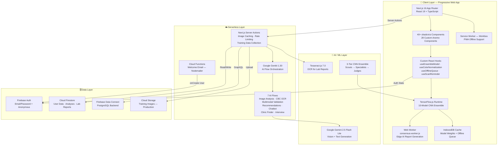

---

### Diagram 2: 10-Model CNN Ensemble Pipeline

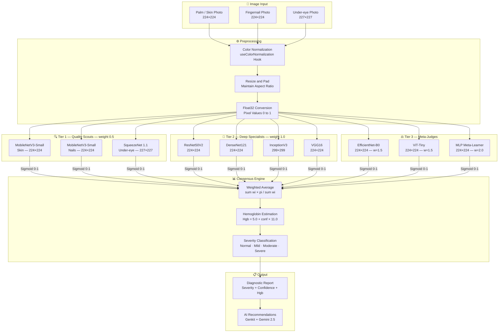

---

### Diagram 3: Complete Database Schema — ER Diagram

```mermaid
erDiagram
    %% ── Cloud Firestore (NoSQL) ──
    FS_User["users/{userId}"] {
        String id PK
        String firstName
        String lastName
        String email
        String address
        String photoURL
        Map medicalInfo
        Map hydration
        Timestamp createdAt
    }
    FS_ImageAnalysis["imageAnalyses"] {
        String id PK
        String userId FK
        String type
        String mode
        Number riskScore
        String anemiaType
        Number confidenceScore
        Number hemoglobin
        String imageAnalysisSummary
        String recommendations
        String labReportSummary
        String notes
        Timestamp createdAt
    }
    FS_LabReport["labReports"] {
        String id PK
        String userId FK
        String type
        Boolean isLocalAnalysis
        String hospitalName
        String doctorName
        Number riskScore
        String anemiaType
        Number confidenceScore
        String recommendations
        Number hemoglobin
        Number hematocrit
        Number redBloodCells
        Number meanCellVolume
        Number meanCellHemoglobin
        Number platelets
        Number whiteBloodCells
        String summary
        Map parameters
        String notes
        Timestamp createdAt
    }
    FS_CycleLog["cycle_logs"] {
        String id PK
        Timestamp startDate
        Timestamp endDate
        String flowIntensity
        Timestamp createdAt
    }
    FS_ChatHistory["chatHistory"] {
        String id PK
        String role
        String content
        Timestamp createdAt
    }
    FS_GameScore["gameScores"] {
        String id PK
        String game
        Number score
        Number total
        Timestamp createdAt
    }
    FS_HealthcareProvider["healthcareProviders"] {
        String id PK
        String name
        String type
        String address
        String contact
        String hours
        String website
        String notes
        Timestamp updatedAt
    }
    FS_TrainingJob["training_jobs"] {
        String id PK
        String storagePath
        String bodyPart
        String prediction
        String userName
        String status
        String createdAt
    }

    FS_User ||--o{ FS_ImageAnalysis : "has"
    FS_User ||--o{ FS_LabReport : "has"
    FS_User ||--o{ FS_CycleLog : "logs"
    FS_User ||--o{ FS_ChatHistory : "chats"
    FS_User ||--o{ FS_GameScore : "plays"
    FS_User ||--o{ FS_TrainingJob : "contributes"

    %% ── Firebase Data Connect (PostgreSQL) ──
    PG_User["User (PostgreSQL)"] {
        UUID id PK
        String displayName
        String email
        String gender
        Date dateOfBirth
        Float height
        Float weight
        Timestamp createdAt
    }
    PG_HealthMetric["HealthMetric"] {
        UUID id PK
        UUID userId FK
        String metricName
        Float value
        String unit
        Timestamp recordedAt
        String notes
    }
    PG_SymptomEntry["SymptomEntry"] {
        UUID id PK
        UUID userId FK
        String symptomName
        Int severity
        Timestamp recordedAt
        String description
    }
    PG_DietaryIntake["DietaryIntake"] {
        UUID id PK
        UUID userId FK
        String foodItem
        Float quantity
        String unit
        Timestamp consumedAt
        Float ironContentEstimate
        Boolean vitaminCConsumption
    }
    PG_AnemiaAssessment["AnemiaAssessment"] {
        UUID id PK
        UUID userId FK
        String riskLevel
        Timestamp assessedAt
        String recommendations
        String notes
    }

    PG_User ||--o{ PG_HealthMetric : "tracks"
    PG_User ||--o{ PG_SymptomEntry : "logs"
    PG_User ||--o{ PG_DietaryIntake : "records"
    PG_User ||--o{ PG_AnemiaAssessment : "receives"
```

---

### Diagram 4: User Analysis Workflow — Sequence Diagram

```mermaid
sequenceDiagram
    actor U as User
    participant UI as React Frontend
    participant HOOK as useEnsembleModel
    participant IDB as IndexedDB Cache
    participant TFJS as TensorFlow.js
    participant WW as Web Worker
    participant SA as Server Actions
    participant GK as Genkit Flow
    participant GM as Gemini 2.5 Flash

    U->>UI: Capture 3 photos — Skin, Nails, Eye
    UI->>HOOK: runAnalysis — Skin, Nails, Eye

    rect rgb(30, 58, 95)
        Note over HOOK,TFJS: Model Loading — 3-Tier Cache
        HOOK->>HOOK: Check session cache
        alt Cache Miss
            HOOK->>IDB: Check IndexedDB
            alt IDB Miss
                HOOK->>TFJS: Fetch from /public/models/
                TFJS-->>IDB: Persist model weights
            end
            IDB-->>HOOK: Return cached model
        end
    end

    rect rgb(74, 45, 107)
        Note over HOOK,TFJS: CNN Ensemble Inference
        HOOK->>TFJS: Tier 1 Scouts — 3 models
        TFJS-->>HOOK: Quality scores 0 to 1
        HOOK->>TFJS: Tier 2 Specialists — 4 models
        TFJS-->>HOOK: Confidence scores 0 to 1
        HOOK->>TFJS: Tier 3 Judges — 3 models
        TFJS-->>HOOK: Meta-predictions 0 to 1
    end

    rect rgb(45, 107, 74)
        Note over HOOK,WW: Consensus and Report
        HOOK->>WW: All predictions + weights
        WW->>WW: Weighted average
        WW->>WW: Hgb = 5.0 + conf × 11.0
        WW->>WW: Classify severity
        WW-->>HOOK: severity, hgb, confidence
    end

    rect rgb(107, 74, 45)
        Note over UI,GM: AI Enhancement
        UI->>SA: runGenerateImageDescription — image
        SA->>SA: Rate limit check — 3s cooldown
        SA->>SA: SHA-256 consistency check
        SA->>GK: generateImageDescription flow
        GK->>GM: Vision analysis prompt
        GM-->>GK: Clinical assessment
        GK-->>SA: description, isValid, analysisResult, confidence
        SA-->>UI: Cached result
    end

    UI-->>U: Diagnostic Report + Recommendations
```

---

### Diagram 5: ML Training to Deployment Pipeline

```mermaid
graph LR
    subgraph TRAINING["🏋️ Training Pipeline — Kaggle GPU"]
        DATA["Synthetic + Real Datasets<br/>HuggingFace + User Contributions"]
        AUG["Data Augmentation<br/>RandomFlip · Rotation · Zoom<br/>ColorJitter · CutOut"]
        TRAIN["TensorFlow/Keras Training<br/>Mixed Precision FP16<br/>AdamW + WarmUp Cosine Decay"]
        EVAL["Evaluation<br/>AUC · F1 · Confusion Matrix<br/>Per-Body-Part Metrics"]
        EXPORT["TF.js Export<br/>INT8 Quantization<br/>Graph Model Format"]
    end

    subgraph DEPLOY["🚀 Deployment"]
        CDN["Vercel / Firebase CDN<br/>Static Model Hosting"]
        PWA["Progressive Web App<br/>Service Worker Cache"]
        EDGE["Edge Inference<br/>Browser TF.js Runtime"]
    end

    DATA --> AUG --> TRAIN --> EVAL --> EXPORT
    EXPORT -->|"model.json + weight shards"| CDN
    CDN --> PWA --> EDGE
```

---

### Diagram 6: Complete Database Architecture

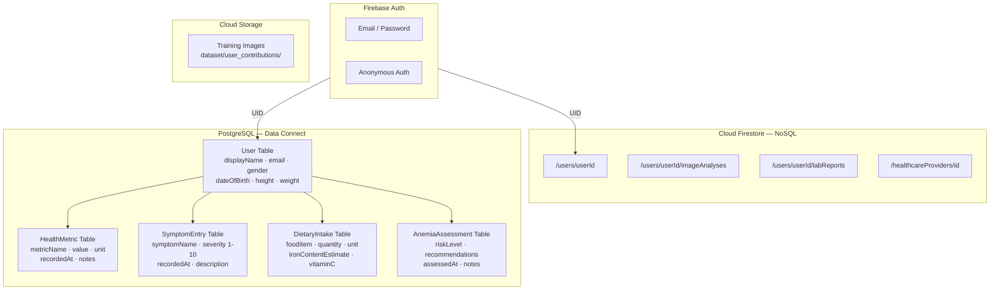

---

### Diagram 7: Application User Flow — Flowchart

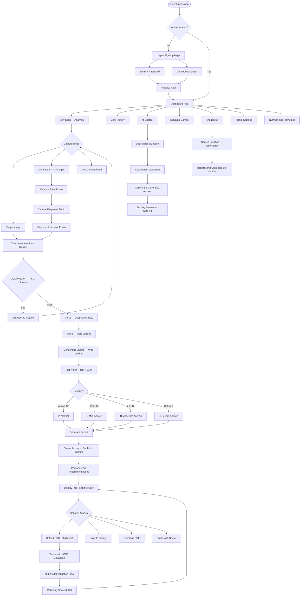

---

### Diagram 8: Genkit AI Flows — Data Flow Diagram

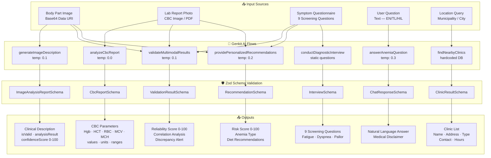

---

### Diagram 9: Authentication and Security Flow

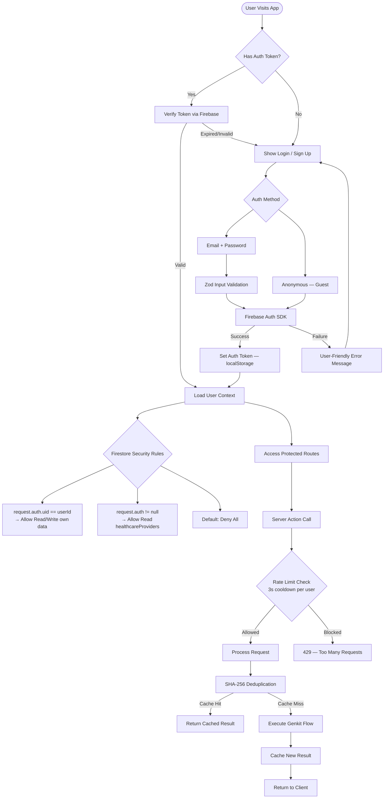

---

### Diagram 10: Model Caching Strategy — 3-Tier Cache

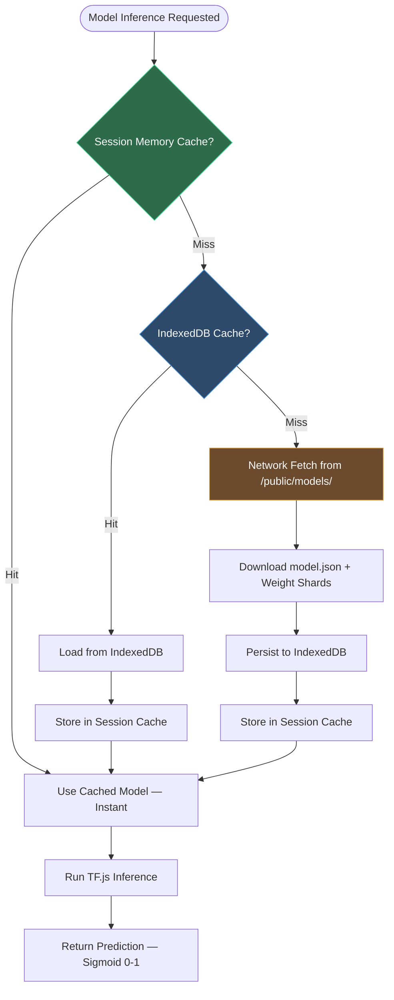

---

### Diagram 11: Firestore Document Structure

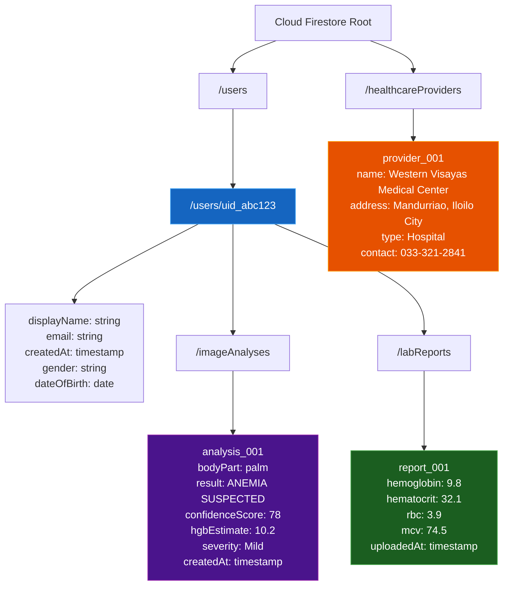

---

### Diagram 12: Deployment Architecture

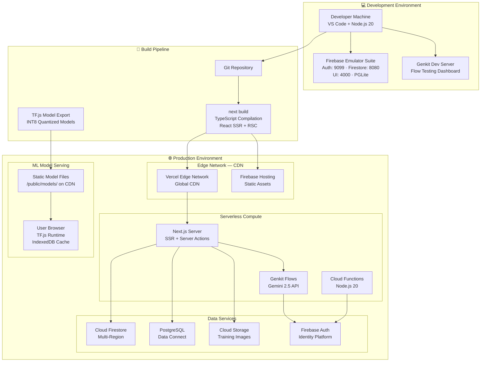

---

*Document generated for: **Anemo AI v3 — BSIT Thesis Research Paper***
*Last updated: 2026*
